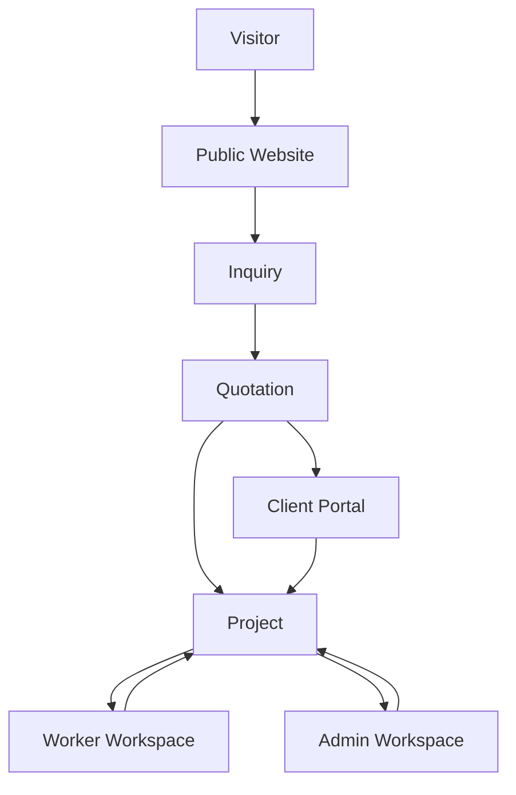

# BDJG — Product Requirements Document

**File:** `PRD.md`  
**Version:** 1.0.0  
**Status:** Baseline Product Specification  
**Date:** 12 August 2026  
**Product:** BDJG Creative Studio Website & Studio Management System  
**Primary internal sources:** `blueprint.md`, `DESIGN-v1.md`, `DESIGN.md`  
**External visual reference:** Mondragon / Mondragon II, especially Demo 6  
**Scope:** product goals, users, scope, priorities, functional requirements, business rules, UX/design requirements, security, privacy, performance, integrations, analytics, acceptance criteria, MVP boundary, and definition of done.  
**Out of scope:** implementation framework selection, database engine selection, hosting/vendor selection, deployment steps, sprint plan, code structure, and low-level API schema.

---

## 01. Document Control

### 1.1 Purpose

This PRD defines **what BDJG must deliver, for whom, at what priority, under which business rules, and how completion is verified**. It converts the broader system blueprint and visual design system into an implementation-ready product contract.

### 1.2 Source-of-truth hierarchy

When documents conflict, use the following precedence:

1. **`PRD.md`** — product intent, scope, priority, business acceptance, release boundary.
2. **`blueprint.md`** — detailed system behavior, role relationships, domain model, status model, operational flow.
3. **`DESIGN-v1.md`** — visual language, layout, interaction, motion, responsive behavior, component grammar, visual QA.
4. **`DESIGN.md`** — supplementary reference notes extracted from the Mondragon direction.
5. **External references** — principle-level references only; they do not override BDJG product rules.

### 1.3 Requirement language

- **MUST** = mandatory for the stated priority/release.
- **SHOULD** = recommended unless a documented trade-off is approved.
- **MAY** = optional.
- **P0** = required for initial production release / MVP.
- **P1** = important, targeted shortly after MVP.
- **P2** = enhancement.
- **Future** = intentionally outside near-term scope.

### 1.4 Requirement ID prefixes

| Prefix | Domain |
|---|---|
| GEN | Cross-product/global |
| PUB | Public website |
| CRM | Inquiry & CRM |
| QUO | Quotation |
| CLI | Client account |
| PAY | Invoice & payment |
| PRJ | Project management |
| CPR | Client portal |
| WRK | Worker workspace |
| TSK | Task management |
| SCH | Schedule/calendar |
| FIL | File management |
| PRV | Preview/review |
| REV | Revision |
| PHT | Photo selection |
| COM | Communication |
| NOT | Notification |
| FIN | Finance |
| ADM | Admin/Owner |
| CMS | Content management |
| AUTH | Roles/permissions |
| AUD | Activity/audit |
| SRCH | Search/filter/sort |
| UX | UX |
| DSG | Design |
| RSP | Responsive |
| A11Y | Accessibility |
| SEC | Security |
| PRVY | Privacy |
| PERF | Performance |
| MED | Media |
| INT | Integration |
| STA | Empty/loading/error states |
| ANA | Analytics |

---

## 02. Product Overview

BDJG is not only a portfolio website. It is a **creative studio operating system** that combines four connected surfaces:

```text
PUBLIC WEBSITE
    ↓
INQUIRY / SALES
    ↓
CLIENT PORTAL
    ↕
STUDIO WORKSPACE
    ├── WORKER
    └── ADMIN / OWNER
```

The central business object is `PROJECT`. Each project connects client, quotation, payment, schedule, team, tasks, files, preview, revisions, expenses, communication, and activity history.

The product must support the complete client journey:

```text
Discover → Request → Quote → Approve → Pay → Produce → Review → Revise → Approve → Deliver
```

and the complete internal journey:

```text
Qualify → Quote → Activate → Assign → Schedule → Produce → QC → Release → Revise → Close → Analyze
```

---

## 03. Product Vision

**Vision statement:**

> Build a premium digital experience where BDJG can acquire clients, run production, coordinate workers, control project quality, collect payments, manage revisions, and deliver final media without depending on fragmented chats, spreadsheets, and disconnected file links.

The product should make each user feel:

- **Visitor:** “This studio has taste and I know how to start a project.”
- **Client:** “My project is organized, transparent, and professionally handled.”
- **Worker:** “I know what I need to do, when it is due, and where the relevant files are.”
- **Admin:** “I can see what needs attention and move work forward.”
- **Owner:** “I can understand the studio’s operational and financial condition.”

---

## 04. Problem Statement

BDJG currently needs a unified product model because creative-studio operations naturally become fragmented across channels such as WhatsApp, email, spreadsheets, calendar apps, cloud storage, payment dashboards, and informal status updates.

The system must solve the following problems:

1. Leads and client requests can be lost or inconsistently followed up.
2. Quotation versions and accepted commercial terms can become ambiguous.
3. Project status is difficult to understand without asking individuals directly.
4. Workers may receive incomplete or outdated production context.
5. Internal drafts can accidentally be exposed before quality control.
6. Client revisions can become unstructured chat messages without round, ownership, or status.
7. Payment state may not match screenshots or browser redirects.
8. Final files can be shared without clear release rules.
9. Finance, worker cost, and profit visibility require stricter access than ordinary project operations.
10. Owner-level visibility is difficult when project, payment, task, and expense data live separately.

---

## 05. Product Goals

### 5.1 Business goals

- Convert portfolio interest into structured project inquiries.
- Increase professionalism of the quotation-to-delivery client experience.
- Reduce lead and project leakage caused by fragmented communication.
- Improve operational visibility across active projects.
- Make project review/revision measurable and traceable.
- Provide reliable invoice/payment visibility.
- Provide owner-level financial and operational insight without exposing sensitive data to other roles.

### 5.2 User goals

- Visitor can understand BDJG work and submit a request without creating an account.
- Client can always identify project status and the next required action.
- Worker can always identify assigned work, deadline, schedule, and required materials.
- Admin can identify blockers, overdue items, client waiting states, payment attention, and resource conflicts.
- Owner can review revenue, outstanding amounts, project costs, and estimated gross profit when data is available.

### 5.3 Product quality goals

- Strong creative identity on public pages without sacrificing usability.
- Operational surfaces prioritize clarity and speed over visual novelty.
- Authorization is enforced at resource level, not only through navigation visibility.
- Critical actions are auditable.
- Media-heavy experiences remain performant and responsive.
- Accessibility target is WCAG 2.2 AA.

---

## 06. Non-Goals

The following are **not required by this PRD** unless separately approved:

- General-purpose ERP functionality unrelated to creative studio operations.
- Payroll, tax filing, or full accounting ledger replacement.
- Public marketplace connecting arbitrary clients and freelancers.
- Social-network features between clients and workers.
- Real-time collaborative video editing.
- Full digital asset management for unlimited enterprise archives.
- Native iOS/Android applications in MVP.
- AI-generated editing, automatic VFX, or autonomous creative decisions.
- Complex HRIS/attendance/payroll.
- Full contract e-signature platform unless an integration is later selected.
- Mandatory use of a specific payment gateway, email provider, WhatsApp provider, storage provider, framework, or database.
- Cloning Mondragon layouts or copyrighted visual assets; the reference is for visual energy and interaction principles only.

---

## 07. User & Role Definition

### 7.1 Visitor

**Scope:** Public.  
**Goal:** discover work, understand services, build trust, and submit a project request.

MUST be able to:

- browse public pages;
- browse selected portfolio;
- view services/packages made public;
- contact BDJG;
- submit `Book a Project` without authentication.

### 7.2 Client

**Scope:** Own data only.  
**Goal:** manage the commercial and delivery side of their own projects.

MUST be able to access only their own quotation, project, schedule, client-shared files, preview, revision, invoice/payment, communication, and final delivery.

### 7.3 Worker

**Scope:** Assigned projects only.  
**Goal:** execute production work.

MUST only gain project access through active assignment or equivalent explicit relationship. Profession such as photographer/editor is an attribute, not a separate security role.

### 7.4 Admin

**Scope:** Operational according to permission.  
**Goal:** run sales and production operations.

Admin privileges may be subdivided, especially for finance, discounts, content, user management, and sensitive system actions.

### 7.5 Owner / Super Admin

**Scope:** System-wide.  
**Goal:** control the entire system, sensitive finance, permissions, and audit.

Owner must be able to perform administrative override only with an auditable record.

---

## 08. Product Architecture

### 8.1 Public Website

Responsibilities:

```text
Branding
Portfolio
Services
Lead generation
Book a Project
Public contact
```

### 8.2 Client Portal

Responsibilities:

```text
Quotation
Project visibility
Schedule
Invoices / payments
Client preview
Revision
Photo selection
Client-shared files
Final delivery
Messages
Notifications
```

### 8.3 Worker Workspace

Responsibilities:

```text
Assigned projects
Tasks
Schedule
Relevant files
Internal preview submission
Revision assignment
Availability
Expense claim
Notifications
```

### 8.4 Admin Workspace

Responsibilities:

```text
Inquiry / CRM
Quotations
Clients
Project operations
Production board
Worker assignment
Tasks / schedule
Internal review
Client release
Revision management
Invoices / payment monitoring
Expenses / finance based on permission
CMS
Communication
Users / roles
Activity / settings
```

### 8.5 System relationship



---

## 09. Core User Journey

### 9.1 Primary business journey

```text
Visitor
→ View Works / Services
→ Book a Project
→ Inquiry Created
→ Admin Contact / Qualification
→ Quotation Created
→ Quotation Sent
→ Client Accepts
→ Client Account Invited/Activated
→ DP Invoice Issued when required
→ Payment Confirmed
→ Project Activated
→ Team Assigned
→ Pre-Production
→ Production
→ Post-Production
→ Internal Review
→ Client Preview
→ Revision Round(s)
→ Client Approval
→ Final Payment when required
→ Final File Release
→ Completed
→ Archived
```

### 9.2 Core principle

All P0 functionality must support or protect this journey. Features that do not materially support this journey should default to P1, P2, or Future.

---

## 10. Product Scope

### 10.1 P0 — Core / MVP

- Public home, works, work detail, services, contact, book project.
- Inquiry capture and admin pipeline.
- Client directory.
- Versioned quotations with client accept/request revision/decline.
- Client account invitation/activation.
- Invoice and internal payment state.
- Project creation and lifecycle.
- Admin project view and production board.
- Worker profiles and project assignments.
- Worker workspace for assigned projects.
- Task management.
- Project schedule/calendar.
- File visibility and version metadata.
- Internal preview and admin release to client.
- Timestamp video comments.
- Revision rounds and status.
- Client portal core actions.
- Notifications: in-app plus at least one operational external channel if configured.
- Role/resource authorization.
- Activity log for critical actions.
- Basic finance: contract value, paid, outstanding, project expenses, estimated gross profit for authorized users.
- CMS for portfolio/services/basic contact content.
- Search/filter on core admin datasets.
- Responsive support and WCAG 2.2 AA target.
- Performance-aware media delivery.

### 10.2 P1 — Important

- Private photo gallery and selection workflow.
- Worker availability management with conflict indications.
- Worker expense claims.
- Expanded finance reports and breakdowns.
- Advanced notification preferences/templates.
- Rich client-facing activity timeline.
- Testimonials and advanced CMS controls.
- More detailed operational reporting.

### 10.3 P2 — Enhancement

- Advanced analytics dashboards.
- Advanced production workload forecasting.
- More sophisticated media comparison/review tools.
- Advanced automated reminders and escalation rules.
- Configurable project templates/workflow presets.
- Optional approval chains beyond baseline roles.

### 10.4 Future

- Native mobile apps.
- AI-assisted production operations.
- Full accounting/payroll.
- Marketplace/freelancer ecosystem.
- Advanced external collaboration with arbitrary third parties.
- Enterprise SSO unless business need emerges.

---

## 11. Functional Requirements

| ID | Priority | Requirement |
|---|---:|---|
| GEN-001 | P0 | The system MUST treat `Project` as the central operational object once activation requirements are satisfied. |
| GEN-002 | P0 | Every project MUST have a unique human-readable Project ID. |
| GEN-003 | P0 | Every protected resource MUST be evaluated against both user role and resource relationship. |
| GEN-004 | P0 | Client resources MUST use `own` scope; worker project resources MUST use `assigned` scope. |
| GEN-005 | P0 | Sensitive finance privileges MUST be separable from ordinary project administration. |
| GEN-006 | P0 | Critical state changes MUST create activity history. |
| GEN-007 | P0 | Status dictionaries MUST be consistent across list, detail, notification, and reporting surfaces. |
| GEN-008 | P0 | Internal-only resources MUST never become client-visible merely because a URL is known. |
| GEN-009 | P0 | User-facing actions MUST return clear success/failure feedback without requiring users to infer state. |
| GEN-010 | P0 | All major records SHOULD preserve creator/updater/time metadata needed for traceability. |

---

## 12. Public Website Requirements

### 12.1 Information architecture

```text
/
/works
/works/{slug}
/services
/services/{slug}
/about
/studio
/contact
/book
```

### 12.2 Requirements

| ID | Priority | Requirement |
|---|---:|---|
| PUB-001 | P0 | Public navigation MUST include Home, Works, Services, About, Studio, Contact, and a prominent Book a Project CTA. |
| PUB-002 | P0 | Home MUST include hero, selected works, capability/service overview, studio statement, trust/social proof where available, CTA, and footer. |
| PUB-003 | P0 | Works MUST support public portfolio browsing and category filtering. |
| PUB-004 | P0 | Work detail MUST support selected metadata, gallery/video media, project story/scope, credits when approved, and related work. |
| PUB-005 | P0 | Services MUST explain service families and available public packages/add-ons without exposing internal costing. |
| PUB-006 | P0 | Book a Project MUST allow a visitor to submit without login. |
| PUB-007 | P0 | Book a Project MUST capture service, package when applicable, add-ons, project brief, preferred/alternative date, location, contact, and reference input where relevant. |
| PUB-008 | P0 | Public content MUST only expose media/projects explicitly permitted for publication. |
| PUB-009 | P0 | Every public page SHOULD maintain a clear route to Book a Project. |
| PUB-010 | P0 | Public motion/media effects MUST have non-motion/touch fallbacks. |
| PUB-011 | P1 | Works MAY support muted hover/tap preview video where performance permits. |
| PUB-012 | P1 | Public availability MAY show only simplified `AVAILABLE / LIMITED / UNAVAILABLE` state without revealing other client/project details. |

### 12.3 Public content voice

Copy SHOULD be short, confident, direct, and visual. Avoid generic corporate phrases and unnecessary technical jargon.

---

## 13. Inquiry & CRM Requirements

### 13.1 Inquiry fields

Minimum conceptual data:

```text
Inquiry ID
Client Name
Email
Phone / WhatsApp
Institution / Company
Service
Package
Add-ons
Preferred Date
Alternative Date
Location
Project Brief
Reference Links / Files
Estimated Budget
Notes
Source
Status
Assigned Admin
Created At
```

### 13.2 Requirements

| ID | Priority | Requirement |
|---|---:|---|
| CRM-001 | P0 | A visitor MUST be able to create an inquiry without an account. |
| CRM-002 | P0 | Each inquiry MUST receive a unique identifier and creation timestamp. |
| CRM-003 | P0 | Inquiry status MUST support `NEW`, `CONTACTED`, `QUALIFIED`, `QUOTATION`, `WON`, `LOST`. |
| CRM-004 | P0 | Admin MUST be able to assign an inquiry to an admin/owner. |
| CRM-005 | P0 | Admin MUST be able to update status and internal notes without exposing those notes publicly. |
| CRM-006 | P0 | Admin MUST be able to create quotation(s) from an inquiry. |
| CRM-007 | P0 | Inquiry MUST become `WON` when the accepted quotation establishes a successful commercial conversion. |
| CRM-008 | P0 | Lost inquiries SHOULD retain a reason when known. |
| CRM-009 | P0 | Pipeline views MUST support filtering by status, assigned admin, service, date, and source where data exists. |
| CRM-010 | P1 | CRM SHOULD surface stale inquiries requiring follow-up. |

---

## 14. Quotation Requirements

### 14.1 Quotation content

```text
Quotation Number
Client
Inquiry Reference
Project Name
Service / Package
Custom Items / Add-ons
Crew / Equipment as applicable
Transportation
Discount
Tax
Subtotal
Grand Total
DP Requirement
Remaining Payment
Validity Period
Terms
Notes
Status
Version
```

### 14.2 Requirements

| ID | Priority | Requirement |
|---|---:|---|
| QUO-001 | P0 | Admin MUST be able to create a quotation from a qualified inquiry/client. |
| QUO-002 | P0 | Quotation status MUST support `DRAFT`, `SENT`, `VIEWED`, `REVISION_REQUESTED`, `ACCEPTED`, `DECLINED`, `EXPIRED`, `CANCELLED`. |
| QUO-003 | P0 | Client MUST only be able to access quotations belonging to their client identity. |
| QUO-004 | P0 | Client MUST be able to Accept, Request Revision, or Decline an eligible quotation. |
| QUO-005 | P0 | Commercial changes MUST create a new version/history rather than silently mutating an accepted record. |
| QUO-006 | P0 | Accepted commercial values MUST be preserved as a contract snapshot for the project. |
| QUO-007 | P0 | Acceptance MUST record actor and timestamp. |
| QUO-008 | P0 | Expired/cancelled quotations MUST not be accepted unless explicitly reactivated or superseded. |
| QUO-009 | P0 | Discount approval MAY require a specific permission threshold/configuration. |
| QUO-010 | P1 | Admin SHOULD be able to duplicate prior quotation structure while generating a new independent record/version. |

---

## 15. Client Account Requirements

| ID | Priority | Requirement |
|---|---:|---|
| CLI-001 | P0 | Inquiry submission MUST NOT require client authentication. |
| CLI-002 | P0 | Client account invitation/activation MUST be available after quotation acceptance or another approved business trigger. |
| CLI-003 | P0 | One client MUST be able to own multiple projects. |
| CLI-004 | P0 | Client profile MUST support name, verified login identity, phone, company/institution, and billing data as needed. |
| CLI-005 | P0 | Client account status MUST support invited/active/suspended/disabled or equivalent. |
| CLI-006 | P0 | Suspended/disabled client access MUST not expose protected project resources. |
| CLI-007 | P0 | Account recovery/change flows MUST protect against unauthorized takeover. |
| CLI-008 | P1 | Client SHOULD be able to maintain basic profile/billing information subject to validation. |

---

## 16. Invoice & Payment Requirements

### 16.1 Model

```text
Project
└── Invoice
    └── Payment Transaction(s)
```

A project MAY have DP, progress, final, and additional invoices.

### 16.2 Requirements

| ID | Priority | Requirement |
|---|---:|---|
| PAY-001 | P0 | Every payment transaction MUST be associated with an invoice. |
| PAY-002 | P0 | Invoice status MUST support `DRAFT`, `ISSUED`, `PARTIALLY_PAID`, `PAID`, `OVERDUE`, `VOID`, `REFUNDED`. |
| PAY-003 | P0 | Internal payment status MUST support `UNPAID`, `PENDING`, `PAID`, `FAILED`, `EXPIRED`, `REFUNDED`, `PARTIALLY_REFUNDED`. |
| PAY-004 | P0 | External gateway statuses MUST be normalized to BDJG internal states. |
| PAY-005 | P0 | Browser redirect or screenshot MUST NOT be treated as the sole source of payment truth. |
| PAY-006 | P0 | Payment status changes MUST be stored in history/audit. |
| PAY-007 | P0 | Manual reconciliation MUST require an authorized role and create an audit record. |
| PAY-008 | P0 | Refund records MUST preserve reason, amount, actor, and status history. |
| PAY-009 | P0 | Client MUST only view own invoices/payment summaries. |
| PAY-010 | P0 | Project activation/release rules MUST evaluate payment state according to project/quotation policy. |
| PAY-011 | P1 | Partial payments SHOULD be represented when supported by business policy. |

---

## 17. Project Management Requirements

### 17.1 Project lifecycle

```text
DRAFT
PRE_PRODUCTION
PRODUCTION
POST_PRODUCTION
INTERNAL_REVIEW
CLIENT_REVIEW
REVISION
FINAL_APPROVAL
FINAL_DELIVERY
COMPLETED
ARCHIVED
CANCELLED
```

### 17.2 Requirements

| ID | Priority | Requirement |
|---|---:|---|
| PRJ-001 | P0 | A project MUST be created/activated only when configured business activation rules are satisfied. |
| PRJ-002 | P0 | Default activation rule SHOULD be `Quotation Accepted + required DP satisfied`. |
| PRJ-003 | P0 | Each project MUST have unique Project ID, client, service context, commercial reference, status, dates, and assigned admin. |
| PRJ-004 | P0 | Project detail MUST aggregate overview, brief, timeline, schedule, team, tasks, files, preview, revision, communication, and activity according to permission. |
| PRJ-005 | P0 | Main project stage MUST be controlled by Admin/Owner, not by ordinary Worker. |
| PRJ-006 | P0 | All project stage changes MUST record actor, prior state, new state, and time. |
| PRJ-007 | P0 | Project MAY have multiple workers through assignment records. |
| PRJ-008 | P0 | Project MUST preserve commercial snapshot even if public service/package content later changes. |
| PRJ-009 | P0 | Completed project MUST NOT automatically become public portfolio content. |
| PRJ-010 | P1 | Project templates MAY prefill common tasks/schedules while creating independent project records. |

---

## 18. Client Portal Requirements

### 18.1 Navigation

```text
Dashboard
My Projects
Quotations
Invoices & Payments
Schedule
Preview & Revision
Files
Messages
Notifications
Profile / Help / Logout
```

### 18.2 Requirements

| ID | Priority | Requirement |
|---|---:|---|
| CPR-001 | P0 | Client dashboard MUST prioritize current status and next required action. |
| CPR-002 | P0 | Dashboard SHOULD surface Active Projects, Waiting for Review, Payment Due, Next Shoot, Unread Notifications, and Recent Files when applicable. |
| CPR-003 | P0 | Client MUST be able to list own projects by active/waiting/completed/archived state. |
| CPR-004 | P0 | Client project detail MUST show only client-facing project data. |
| CPR-005 | P0 | Client MUST NOT see internal expense, worker cost, profit, internal notes, private drafts, or sensitive admin activity. |
| CPR-006 | P0 | Dynamic CTA MUST reflect state, e.g. Pay Invoice, Review Preview, Submit Revision, Download Final, View Schedule. |
| CPR-007 | P0 | Client MUST be able to find quotation, payment, preview/revision, and final files without navigating internal terminology. |
| CPR-008 | P0 | Client-facing timeline/activity MUST exclude internal-only events. |
| CPR-009 | P1 | Client MAY receive richer progress explanations while preserving internal workflow details. |

---

## 19. Worker Workspace Requirements

### 19.1 Navigation

```text
Dashboard
My Projects
My Tasks
Schedule
Revisions
Files
Availability
Expense Claims
Notifications
Profile / Logout
```

### 19.2 Requirements

| ID | Priority | Requirement |
|---|---:|---|
| WRK-001 | P0 | Worker MUST only see projects with an active assignment/authorized relationship. |
| WRK-002 | P0 | Worker dashboard MUST prioritize tasks, deadlines, revisions, upcoming shoots, and pending internal review. |
| WRK-003 | P0 | Worker project view MUST include only relevant brief, schedule, team context, tasks, files, internal notes, and assigned feedback. |
| WRK-004 | P0 | Worker MUST NOT see client payments, project profit, general client database, or unrelated projects. |
| WRK-005 | P0 | Worker MUST be able to update eligible own task status and upload work/review material. |
| WRK-006 | P0 | Worker MUST NOT directly release client preview/final delivery unless explicitly granted release permission; default is no. |
| WRK-007 | P1 | Worker SHOULD be able to update availability. |
| WRK-008 | P1 | Worker SHOULD be able to submit expense claims without seeing broader project finance. |

---

## 20. Task Management Requirements

### 20.1 Task status

```text
TODO
IN_PROGRESS
REVIEW
BLOCKED
DONE
CANCELLED
```

### 20.2 Requirements

| ID | Priority | Requirement |
|---|---:|---|
| TSK-001 | P0 | Every task MUST belong to a project. |
| TSK-002 | P0 | Task MUST support title, description, assignee, reviewer, priority, status, start/due date, dependencies, attachment/comment context, creator. |
| TSK-003 | P0 | Worker MUST be able to start/update assigned eligible tasks. |
| TSK-004 | P0 | Worker MUST be able to mark a task blocked and provide context. |
| TSK-005 | P0 | Worker MUST be able to submit a task for review when eligible. |
| TSK-006 | P0 | Task assignment MUST NOT grant finance permissions. |
| TSK-007 | P0 | Admin MUST be able to create/reassign/update tasks within project permissions. |
| TSK-008 | P0 | Overdue tasks MUST be visually distinguishable and searchable/filterable. |
| TSK-009 | P1 | Task dependencies SHOULD inform blocked/ready states. |

---

## 21. Schedule Requirements

### 21.1 Event types

```text
Shoot
Meeting
Pre-Production
Editing Deadline
Client Review Deadline
Revision Deadline
Final Delivery
Worker Availability
```

### 21.2 Requirements

| ID | Priority | Requirement |
|---|---:|---|
| SCH-001 | P0 | Schedule event MUST support project, type, date/time, location, assigned team, visibility, notes, and status. |
| SCH-002 | P0 | Client MUST only see events marked client-visible for own project. |
| SCH-003 | P0 | Worker MUST only see events relevant to assigned projects/availability. |
| SCH-004 | P0 | Preferred dates from inquiry MUST remain tentative until Admin confirmation. |
| SCH-005 | P0 | Admin MUST be able to view production calendar across projects. |
| SCH-006 | P0 | Important schedule changes SHOULD trigger relevant notifications. |
| SCH-007 | P1 | System SHOULD indicate worker schedule conflicts/availability conflicts when detectable. |
| SCH-008 | P1 | Public availability MAY expose only simplified availability status. |

---

## 22. File Management Requirements

### 22.1 File groups

```text
Client Reference
Internal Working Files
Raw Media
Internal Preview
Client Preview
Revision
Final Delivery
```

### 22.2 Visibility

```text
INTERNAL_ONLY
ASSIGNED_WORKERS
CLIENT_SHARED
FINAL_CLIENT
```

### 22.3 Requirements

| ID | Priority | Requirement |
|---|---:|---|
| FIL-001 | P0 | Every protected file MUST be associated with project/resource visibility rules. |
| FIL-002 | P0 | File metadata MUST include project, name, type/category, version where relevant, uploader, visibility, status, size/time metadata where available. |
| FIL-003 | P0 | Internal-only files MUST not be downloadable by clients. |
| FIL-004 | P0 | Assigned-worker files MUST not be available to unassigned workers. |
| FIL-005 | P0 | Client-shared files MUST only be accessible to the owning client/project. |
| FIL-006 | P0 | Preview/deliverable versioning MUST preserve old versions in internal history when required. |
| FIL-007 | P0 | Final files MUST only become client-visible after authorized release. |
| FIL-008 | P0 | Deleting/replacing critical media SHOULD not erase required audit/version history. |
| FIL-009 | P1 | Download bundles MAY be provided for final delivery. |

---

## 23. Preview & Review Requirements

| ID | Priority | Requirement |
|---|---:|---|
| PRV-001 | P0 | Worker/internal upload MUST default to internal visibility. |
| PRV-002 | P0 | Internal preview MUST pass Admin/authorized internal review before client release. |
| PRV-003 | P0 | Admin/Owner MUST explicitly release an eligible preview to client. |
| PRV-004 | P0 | Client MUST only see released preview versions belonging to own project. |
| PRV-005 | P0 | Video preview MUST support playback and timestamp-bound comments. |
| PRV-006 | P0 | Preview comments MUST support author, timestamp, comment text, status, replies where applicable, created/resolved time. |
| PRV-007 | P0 | Comment state MUST support `OPEN`, `IN_PROGRESS`, `RESOLVED`, `REJECTED` or normalized equivalent. |
| PRV-008 | P0 | Internal notes MUST remain distinct from client comments. |
| PRV-009 | P0 | Older preview versions SHOULD remain visible internally for traceability even after new release. |
| PRV-010 | P1 | Client MAY compare relevant preview versions where useful. |

---

## 24. Revision Requirements

### 24.1 Revision status

```text
REQUESTED
TRIAGE
IN_PROGRESS
INTERNAL_REVIEW
READY_FOR_CLIENT
APPROVED
CLOSED
```

### 24.2 Requirements

| ID | Priority | Requirement |
|---|---:|---|
| REV-001 | P0 | Revision MUST be a structured object, not merely a chat thread. |
| REV-002 | P0 | Each revision MUST have project, preview version, round number, requester, requested time, items, status, and assignment data as applicable. |
| REV-003 | P0 | Client MUST be able to submit revision items against an eligible released preview. |
| REV-004 | P0 | Revision items SHOULD preserve timestamp reference for video feedback where supplied. |
| REV-005 | P0 | Admin MUST triage revision and assign relevant worker(s). |
| REV-006 | P0 | Worker MUST be able to update assigned revision work but MUST NOT self-release to client by default. |
| REV-007 | P0 | Revision output MUST return through internal review before client release. |
| REV-008 | P0 | Package revision limits MUST be visible as included/used/remaining where applicable. |
| REV-009 | P0 | Additional revision beyond included limit MUST require explicit business decision and MAY create additional quotation/invoice. |
| REV-010 | P0 | Approval/closure MUST preserve actor/time history. |

---

## 25. Photo Selection Requirements

**Priority:** P1 unless photo-selection is essential to launch offerings.

| ID | Priority | Requirement |
|---|---:|---|
| PHT-001 | P1 | Client MUST only access private gallery belonging to own project. |
| PHT-002 | P1 | Gallery SHOULD support View, Favorite, Select, Comment, and optionally Compare. |
| PHT-003 | P1 | Gallery MUST support total photos, selection limit, selected count, deadline, and selection status where configured. |
| PHT-004 | P1 | Status SHOULD support `NOT_STARTED`, `IN_PROGRESS`, `SUBMITTED`, `LOCKED`. |
| PHT-005 | P1 | Client MUST be prevented from exceeding selection limit unless business rule allows. |
| PHT-006 | P1 | Submitted/locked selections MUST preserve selection snapshot/history. |

---

## 26. Communication Requirements

### 26.1 Communication scopes

- **Internal Note:** Admin + relevant assigned worker; never client.
- **Client Thread:** Client + Admin; worker access only when project permission explicitly permits.

### 26.2 Requirements

| ID | Priority | Requirement |
|---|---:|---|
| COM-001 | P0 | Internal notes and client-visible messages MUST be separate scopes. |
| COM-002 | P0 | Default client communication path MUST be Client ↔ Admin. |
| COM-003 | P0 | Worker MUST only receive client feedback relevant to assigned work unless broader permission exists. |
| COM-004 | P0 | Message records SHOULD link to project/resource context when relevant. |
| COM-005 | P0 | Client MUST NOT be able to discover internal notes through search, activity, or direct resource access. |
| COM-006 | P1 | Templates MAY be used for repeated operational communications. |

---

## 27. Notification Requirements

### 27.1 Channels

```text
IN_APP
EMAIL
WHATSAPP
```

External channels are configuration-dependent; the system must not assume all channels are always available.

### 27.2 Core triggers

P0 triggers SHOULD include:

- new inquiry;
- quotation sent/accepted/revision requested;
- invoice issued / payment state changed;
- project activated;
- worker assigned;
- important schedule created/changed;
- task assigned;
- client preview ready;
- revision requested/ready;
- final payment due;
- final file released;
- project completed.

### 27.3 Requirements

| ID | Priority | Requirement |
|---|---:|---|
| NOT-001 | P0 | Notification MUST link users back to the authoritative system resource whenever possible. |
| NOT-002 | P0 | Notification MUST NOT be the only storage location for important project/payment information. |
| NOT-003 | P0 | Recipient selection MUST obey role/resource visibility. |
| NOT-004 | P0 | Notification record SHOULD store recipient, channel, template/type, related resource, delivery state, sent/read time where available. |
| NOT-005 | P0 | Delivery state SHOULD normalize provider states such as queued/sent/delivered/failed/read where supported. |
| NOT-006 | P0 | Failure to send an external notification MUST NOT corrupt the underlying business transaction. |
| NOT-007 | P1 | User notification preferences MAY control non-critical channels while preserving mandatory operational/security notices. |

---

## 28. Finance Requirements

### 28.1 Finance questions

The finance surface must answer:

1. What is the contract/project value?
2. How much has been received?
3. How much remains outstanding?
4. What costs have been recorded?
5. What is estimated/final gross profit when authorized?

### 28.2 Requirements

| ID | Priority | Requirement |
|---|---:|---|
| FIN-001 | P0 | Authorized finance users MUST see contract value, cash received, outstanding, project expense, and estimated gross profit where inputs exist. |
| FIN-002 | P0 | Worker MUST NOT see project profit. |
| FIN-003 | P0 | Client MUST NOT see internal expense or worker cost. |
| FIN-004 | P0 | Admin finance permission MUST be separable from admin project permission. |
| FIN-005 | P0 | Project expenses MUST support category, amount, project, date, status, and supporting evidence/notes where relevant. |
| FIN-006 | P0 | Expense status SHOULD support `DRAFT`, `SUBMITTED`, `APPROVED`, `REJECTED`, `PAID`. |
| FIN-007 | P0 | Profit calculation MUST identify itself as estimated when costs/revenue are not final. |
| FIN-008 | P1 | Finance SHOULD provide month/service/project breakdowns and outstanding invoice reporting. |
| FIN-009 | P1 | Worker expense claim SHOULD feed an approval flow before becoming approved project expense. |

---

## 29. Admin & Owner Requirements

### 29.1 Admin navigation groups

```text
Dashboard
Sales
Projects
Team
Finance
Content
Communication
System
```

### 29.2 Requirements

| ID | Priority | Requirement |
|---|---:|---|
| ADM-001 | P0 | Admin dashboard MUST be attention-oriented, not merely a static metric page. |
| ADM-002 | P0 | Admin SHOULD see new inquiries, quotation waiting, active projects, client review waiting, open revisions, invoices due, and today/upcoming production. |
| ADM-003 | P0 | Admin MUST have a production board grouped by major project stages. |
| ADM-004 | P0 | Admin MUST be able to manage client, project, assignment, task, schedule, preview release, revision, and payment monitoring according to permission. |
| ADM-005 | P0 | Owner MUST be able to manage admins/permissions and view sensitive finance/audit. |
| ADM-006 | P0 | Sensitive owner/admin actions MUST create audit entries. |
| ADM-007 | P0 | Owner override MUST be explicit and logged. |
| ADM-008 | P1 | Dashboard SHOULD highlight worker conflicts, overdue tasks, stale quotes, and waiting-client/admin states. |

---

## 30. Content Management Requirements

| ID | Priority | Requirement |
|---|---:|---|
| CMS-001 | P0 | Authorized content users MUST manage public portfolio. |
| CMS-002 | P0 | Portfolio entry MUST support title, category, cover/media, description, credits, year, featured state, visibility, and SEO metadata where applicable. |
| CMS-003 | P0 | Authorized content users MUST manage services and public package/add-on information. |
| CMS-004 | P0 | Publishing a project as portfolio MUST require explicit public permission/state independent of project completion. |
| CMS-005 | P0 | Portfolio permission/state MUST conceptually support `PUBLIC`, `PRIVATE`, `PENDING_APPROVAL`. |
| CMS-006 | P1 | CMS SHOULD manage testimonials, home featured projects, team display, FAQ, and contact information. |
| CMS-007 | P0 | CMS content changes MUST NOT alter historical quotation/project snapshots. |

---

## 31. Roles & Permissions Requirements

### 31.1 Security model

```text
ROLE BASELINE
+
PERMISSION
+
RESOURCE RELATIONSHIP
```

### 31.2 Requirements

| ID | Priority | Requirement |
|---|---:|---|
| AUTH-001 | P0 | Authorization MUST default to deny when no explicit permission/relationship grants access. |
| AUTH-002 | P0 | Client authorization MUST validate ownership of every protected resource. |
| AUTH-003 | P0 | Worker authorization MUST validate active assignment or explicit resource relationship. |
| AUTH-004 | P0 | Hidden navigation MUST NOT be treated as authorization. |
| AUTH-005 | P0 | Permission checks MUST protect server-side/resource actions, not only UI controls. |
| AUTH-006 | P0 | Admin capabilities MUST be granular enough to separate project, finance, content, user, and system privileges. |
| AUTH-007 | P0 | Role/permission changes MUST be audited. |
| AUTH-008 | P0 | Removing/suspending a worker assignment MUST revoke or appropriately reduce access. |
| AUTH-009 | P0 | Owner/Super Admin access MUST be restricted to trusted accounts and protected more strongly than ordinary accounts. |
| AUTH-010 | P1 | Sensitive admin actions SHOULD support re-authentication or additional verification based on implementation risk assessment. |

---

## 32. Activity & Audit Requirements

### 32.1 Mandatory event families

```text
Security/login events
Role/permission changes
Quotation changes/acceptance
Invoice/payment changes
Project status changes
Worker assignment
File upload/release
Revision request/resolution
Expense approval
Project completion
Critical settings/integration changes
```

### 32.2 Requirements

| ID | Priority | Requirement |
|---|---:|---|
| AUD-001 | P0 | Audit entry MUST identify event type, actor, timestamp, affected resource, and relevant before/after state where meaningful. |
| AUD-002 | P0 | Audit records for critical actions MUST not be editable by ordinary users. |
| AUD-003 | P0 | Client-facing activity MUST be a filtered projection and MUST not expose sensitive internal activity. |
| AUD-004 | P0 | Admin/Owner MUST be able to inspect activity history based on permission. |
| AUD-005 | P0 | Payment/reconciliation and permission changes MUST receive high audit priority. |
| AUD-006 | P1 | Audit search/filter SHOULD support actor, resource, event type, and date. |

---

## 33. Search / Filter / Sorting Requirements

| ID | Priority | Requirement |
|---|---:|---|
| SRCH-001 | P0 | Admin search MUST support Project ID/name, Client name/contact, Quotation number, Invoice number, and Worker where applicable. |
| SRCH-002 | P0 | Project filters MUST support status, service, client, assigned admin/worker, date, payment, and revision status where relevant. |
| SRCH-003 | P0 | Finance filters MUST support date, client, project, payment/invoice status, and expense category. |
| SRCH-004 | P0 | Active filters MUST remain visible and removable. |
| SRCH-005 | P0 | Search results MUST respect authorization and never reveal unauthorized record existence/details. |
| SRCH-006 | P1 | Sorting SHOULD support common operational columns such as date, deadline, status, value, and last activity. |

---

## 34. Functional Business Rules

1. Inquiry may be created without account.
2. One inquiry may produce multiple quotation versions.
3. Quotation acceptance must preserve commercial snapshot/history.
4. Client account may be activated after accepted quotation or approved trigger.
5. One client may own many projects.
6. Project must always have a client.
7. Project can have many workers.
8. Worker access exists only through assignment/authorized relationship.
9. Project main stage is controlled by Admin/Owner.
10. Task assignment never grants finance access.
11. Internal preview is invisible to client by default.
12. Client preview requires explicit release.
13. Revision has round and status.
14. Included revision limits may come from package/quotation.
15. Additional revision may be billable.
16. Final file is invisible until released.
17. Final release may depend on payment rule.
18. Payment is stateful; `PENDING` can later become `PAID`, `FAILED`, or `EXPIRED`.
19. Client cannot see internal expenses.
20. Worker cannot see profit.
21. Portfolio publication is independent of project completion and requires publication permission.
22. Critical state changes must be auditable.

---

## 35. UX Requirements

| ID | Priority | Requirement |
|---|---:|---|
| UX-001 | P0 | Each surface MUST prioritize the primary user question for that role. |
| UX-002 | P0 | Client pages MUST prioritize current status and next action over internal production terminology. |
| UX-003 | P0 | Worker pages MUST prioritize task, deadline, schedule, files, revision. |
| UX-004 | P0 | Admin pages MUST prioritize attention, exceptions, blockers, status, and fast navigation. |
| UX-005 | P0 | Important actions MUST use descriptive labels, not ambiguous icon-only controls. |
| UX-006 | P0 | Destructive actions MUST show object context and consequence before confirmation. |
| UX-007 | P0 | Status MUST not rely on color alone. |
| UX-008 | P0 | Deep admin/project routes SHOULD provide breadcrumbs. |
| UX-009 | P0 | Routine portal actions MUST avoid cinematic delays/animations. |
| UX-010 | P0 | All interactive components MUST define relevant default, hover, focus-visible, active, selected, disabled, loading, error, and success states. |

---

## 36. Design Requirements

### 36.1 Experience zones

```text
PUBLIC = EXPERIENCE / 100% brand expression
CLIENT = TRUST / 40–50% brand expression
WORKER = FOCUS / 15–20% brand expression
ADMIN = CONTROL / 5–10% brand expression
```

### 36.2 Visual DNA

BDJG SHOULD use:

```text
near-black canvas
off-white typography
muted greys
one restrained accent
large editorial display type
small technical/mono metadata
strong real portfolio media
asymmetrical layouts on public surface
curved blocks / transitions where purposeful
controlled motion
film-oriented labels such as PROJECT / CUT / FRAME / YEAR
```

### 36.3 Requirements

| ID | Priority | Requirement |
|---|---:|---|
| DSG-001 | P0 | Public site MUST feel cinematic/editorial/media-led rather than like a generic SaaS landing page. |
| DSG-002 | P0 | Client portal MUST remain visually related to public brand but substantially calmer and more structured. |
| DSG-003 | P0 | Worker/Admin MUST prioritize functional information density and MUST NOT use distracting public-site effects such as custom cursor, full-screen video hero, or dashboard parallax. |
| DSG-004 | P0 | Shared brand grammar MUST include logo, typography family, accent logic, icon family, status grammar, and button grammar. |
| DSG-005 | P0 | Public hero SHOULD use large layered typography/media composition and MUST avoid generic centered headline + dashboard screenshot patterns. |
| DSG-006 | P0 | Portfolio layout SHOULD avoid repetitive identical card grids as the only presentation mode. |
| DSG-007 | P0 | Primary accent MUST be restrained and used for action/focus/selection/progress/important data rather than large decorative surfaces everywhere. |
| DSG-008 | P0 | Real portfolio media MUST have priority over generic stock or decorative illustration. |
| DSG-009 | P0 | Motion MUST support narrative/feedback and MUST not exist only because it looks unusual. |
| DSG-010 | P0 | Mondragon Demo 6 is inspiration for energy, curved interaction, motion, and presentation—not a layout to clone. |

---

## 37. Responsive Requirements

Baseline breakpoints from design direction:

```text
Mobile  < 640
Tablet  640–1023
Desktop 1024–1439
Wide    1440+
```

Exact implementation breakpoints may adapt if behavior is preserved.

| ID | Priority | Requirement |
|---|---:|---|
| RSP-001 | P0 | Public experience MUST be intentionally composed for mobile, not merely scaled down from desktop. |
| RSP-002 | P0 | Mobile MUST reduce overlap, rotation, pointer dependency, parallax, and extreme spacing while retaining strong typography/media hierarchy. |
| RSP-003 | P0 | Hover-only functionality MUST have tap/keyboard equivalent. |
| RSP-004 | P0 | Client mobile MUST keep priority actions easy to reach and convert complex tables to stacked data cards when appropriate. |
| RSP-005 | P0 | Admin mobile MAY focus on monitoring/essential actions rather than forcing every dense desktop workflow into mobile parity. |
| RSP-006 | P0 | No critical content/action MAY be inaccessible due to viewport size or orientation. |

---

## 38. Accessibility Requirements

**Target:** WCAG 2.2 AA.

| ID | Priority | Requirement |
|---|---:|---|
| A11Y-001 | P0 | All core workflows MUST be keyboard operable. |
| A11Y-002 | P0 | Keyboard focus MUST remain visibly indicated and not be intentionally removed without an equivalent visible replacement. |
| A11Y-003 | P0 | Focused controls MUST not be completely hidden behind sticky/overlay UI. |
| A11Y-004 | P0 | Text and critical UI contrast MUST meet WCAG 2.2 AA applicable criteria. |
| A11Y-005 | P0 | Forms MUST have programmatically associated labels and errors. |
| A11Y-006 | P0 | Status/error information MUST not depend on color alone. |
| A11Y-007 | P0 | Heading hierarchy and landmarks SHOULD be semantic and meaningful. |
| A11Y-008 | P0 | Relevant prerecorded media SHOULD provide captions/transcript when audio conveys meaningful information and publication context requires it. |
| A11Y-009 | P0 | Reduced-motion preference MUST disable or simplify parallax, custom cursor effects, large displacement, and cinematic transitions. |
| A11Y-010 | P0 | Touch targets/interactions MUST remain usable without precision pointer input. |
| A11Y-011 | P0 | Authentication/recovery flows SHOULD avoid unnecessary cognitive tests and support accessible authentication practices. |

---

## 39. Security Requirements

Security principle:

```text
DENY BY DEFAULT
LEAST PRIVILEGE
ROLE + RESOURCE RELATIONSHIP
AUTHORIZATION ON EVERY PROTECTED ACTION
AUDIT SENSITIVE ACTIONS
```

| ID | Priority | Requirement |
|---|---:|---|
| SEC-001 | P0 | Protected resources MUST require authenticated identity plus authorization check. |
| SEC-002 | P0 | Authorization MUST be enforced for every protected object/action; predictable IDs MUST not grant access. |
| SEC-003 | P0 | Client MUST not access another client's data by modifying URL/identifier/request. |
| SEC-004 | P0 | Worker MUST not access unassigned project data by modifying URL/identifier/request. |
| SEC-005 | P0 | Privilege checks MUST use server-side/business authorization; client-side hiding is insufficient. |
| SEC-006 | P0 | Sensitive changes such as role, permission, payment reconciliation, refund, file release, and critical settings MUST be audited. |
| SEC-007 | P0 | Authentication/session design MUST protect session tokens and invalidate/reduce access after disable/suspension/privilege removal. |
| SEC-008 | P0 | Uploaded files and references MUST be treated as untrusted input and validated according to type/size/security policy. |
| SEC-009 | P0 | Integration secrets MUST never be exposed in public/client browser contexts. |
| SEC-010 | P0 | Owner/Admin privileged accounts SHOULD support MFA or equivalent stronger authentication where implementation permits. |
| SEC-011 | P0 | Error responses MUST avoid leaking sensitive authorization/system details. |

---

## 40. Privacy Requirements

Sensitive information includes:

```text
Client contact
Billing data
Project brief
Private media
Raw footage
Internal preview
Finance
Worker cost
Profit
Internal notes
System activity
```

| ID | Priority | Requirement |
|---|---:|---|
| PRVY-001 | P0 | Public website MUST only display intentionally published content. |
| PRVY-002 | P0 | Project completion MUST NOT imply portfolio publication consent. |
| PRVY-003 | P0 | Client and worker resource boundaries MUST apply to file URLs/downloads, not only page UI. |
| PRVY-004 | P0 | Logs/analytics MUST avoid unnecessary collection/exposure of private media or sensitive finance content. |
| PRVY-005 | P0 | Public/client surfaces MUST not expose internal notes, raw worker cost, profit, or security activity. |
| PRVY-006 | P1 | Retention/archive rules for raw media and private uploads SHOULD be defined before long-term scale. |

---

## 41. Performance Requirements

The public site is media-heavy; visual ambition must be performance-aware.

| ID | Priority | Requirement |
|---|---:|---|
| PERF-001 | P0 | Public pages SHOULD target Core Web Vitals “good” thresholds at p75 where practical: LCP ≤ 2.5s, INP ≤ 200ms, CLS ≤ 0.1. |
| PERF-002 | P0 | Hero media MUST NOT block access to primary content/CTA if media loads slowly or fails. |
| PERF-003 | P0 | Images MUST use responsive sizing/compression and avoid sending full-resolution originals when unnecessary. |
| PERF-004 | P0 | Video SHOULD use poster/thumbnail and controlled loading rather than simultaneous full-load autoplay across many elements. |
| PERF-005 | P0 | Public pages MUST avoid excessive simultaneous autoplay video, continuous heavy 3D transforms, and multiple expensive blur layers. |
| PERF-006 | P0 | Internal dashboards SHOULD prioritize fast interaction and data clarity over decorative media. |
| PERF-007 | P0 | Loading states MUST prevent layout shifts that materially degrade usability. |
| PERF-008 | P1 | Performance telemetry SHOULD measure key public routes and major portal interactions. |

---

## 42. Media Requirements

| ID | Priority | Requirement |
|---|---:|---|
| MED-001 | P0 | Public media MUST support high-quality presentation with optimized derivatives rather than always serving originals. |
| MED-002 | P0 | Video preview MUST distinguish internal preview from client-released preview. |
| MED-003 | P0 | Media must retain project/version/visibility metadata needed for traceability. |
| MED-004 | P0 | Client preview/final delivery should display clear labels such as `CLIENT PREVIEW`, `V1/V2/V3`, `FINAL`. |
| MED-005 | P0 | Video interaction MUST not require autoplay audio. |
| MED-006 | P0 | Media failure MUST produce usable fallback/error state rather than blank critical UI. |
| MED-007 | P1 | Large media may use CDN/transcoding/streaming infrastructure selected during implementation. |

---

## 43. Integration Requirements

### 43.1 Payment integration boundary

The product is vendor-neutral. Required conceptual capabilities:

```text
Create Payment
Receive Payment Status
Check Payment Status
Handle Expiry
Handle Failure
Handle Refund
Store Transaction Reference
```

If Midtrans or a similar gateway is selected, implementation must verify trusted notifications/signatures according to provider documentation and reconcile state using server-side status mechanisms where necessary.

### 43.2 Email / WhatsApp boundary

Required conceptual flow:

```text
Notification Event
→ Template
→ Channel
→ Recipient
→ Provider
→ Delivery Status
```

### 43.3 Requirements

| ID | Priority | Requirement |
|---|---:|---|
| INT-001 | P0 | Integration adapters MUST map provider-specific state to stable internal BDJG state. |
| INT-002 | P0 | Business logic MUST not depend directly on a provider-specific UI redirect. |
| INT-003 | P0 | Webhook/event handling MUST be resilient to retries/duplicate delivery and should be idempotent. |
| INT-004 | P0 | Payment event ordering MUST not regress a confirmed transaction to an older state without validation. |
| INT-005 | P0 | Provider outage/failure MUST be surfaced without corrupting internal records. |
| INT-006 | P0 | External message delivery status MAY be stored only to the granularity actually supported by the provider. |
| INT-007 | P1 | Calendar/storage/media provider integration MAY be added behind an adapter boundary. |

---

## 44. Error / Empty / Loading States

### 44.1 Attention vocabulary

```text
NORMAL
NEEDS ACTION
URGENT
BLOCKED
OVERDUE
WAITING CLIENT
WAITING ADMIN
WAITING WORKER
WAITING PAYMENT
```

### 44.2 Requirements

| ID | Priority | Requirement |
|---|---:|---|
| STA-001 | P0 | Every major list/page MUST define an empty state with next action where appropriate. |
| STA-002 | P0 | Loading state MUST communicate progress without causing misleading permanent values. |
| STA-003 | P0 | Error state MUST explain what failed and provide a recovery action when possible. |
| STA-004 | P0 | Permission-denied state MUST not expose private record details. |
| STA-005 | P0 | Success feedback MUST be clear but restrained on operational surfaces. |
| STA-006 | P0 | Blocked/overdue/attention states MUST be distinguishable by icon/label as well as color. |
| STA-007 | P0 | Destructive operation errors MUST preserve the original data unless the operation actually completed. |

---

## 45. Analytics & Product Metrics

### 45.1 Business metrics

Track when data is available:

- Inquiry count by source/service.
- Inquiry → quotation rate.
- Quotation → accepted/project rate.
- Time from inquiry to first admin action.
- Time from quotation sent to decision.
- Active/completed/cancelled projects.
- Average project cycle time.
- Average revision rounds per project/service.
- Outstanding invoice amount.
- Payment aging/overdue count.
- Project expenses and estimated gross profit for authorized reporting.
- Service/package performance.

### 45.2 Product/operational metrics

- Client preview review completion time.
- Revision turnaround time.
- Overdue task count/time.
- Worker schedule conflicts.
- Notification delivery failure rate by channel.
- Public Book a Project funnel completion.
- Public Core Web Vitals.
- Error rate for payment/file/preview flows.

### 45.3 Requirements

| ID | Priority | Requirement |
|---|---:|---|
| ANA-001 | P0 | Critical business events MUST expose enough structured data to support later reporting. |
| ANA-002 | P0 | Analytics MUST respect role/privacy boundaries. |
| ANA-003 | P0 | Public funnel analytics SHOULD measure landing/service/work → book flow without collecting unnecessary sensitive project content. |
| ANA-004 | P1 | Admin/Owner dashboards SHOULD visualize validated operational/business metrics. |
| ANA-005 | P1 | KPI targets SHOULD be set after baseline data is available rather than inventing unsupported targets pre-launch. |

---

## 46. Acceptance Criteria

This section provides cross-feature acceptance scenarios. Feature-specific tests should reference requirement IDs.

### AC-01 — Inquiry without account

**Given** a visitor is not authenticated  
**When** they complete valid Book a Project fields and submit  
**Then** an inquiry is created with unique ID and `NEW` status  
**And** the visitor is not forced to create an account  
**And** an authorized admin can see the inquiry  
**And** no other client/visitor can access the inquiry record.

### AC-02 — Quotation version safety

**Given** Quotation V1 has been sent  
**When** admin changes price/scope after client requests revision  
**Then** the system preserves V1 history  
**And** creates/records a new version  
**And** acceptance always points to the exact accepted version.

### AC-03 — Client cannot access another client project

**Given** Client A is logged in and owns Project A  
**When** Client A requests a URL/resource identifier for Project B owned by Client B  
**Then** access is denied  
**And** no private Project B data, file metadata, preview, invoice, or activity is exposed.

### AC-04 — Worker assignment boundary

**Given** Worker X is assigned to Project A but not Project B  
**When** Worker X requests Project B or its protected files/tasks  
**Then** access is denied even if Worker X knows the URL/ID.

### AC-05 — Project activation

**Given** quotation is accepted  
**And** DP is required  
**When** payment is not yet confirmed  
**Then** project MUST NOT become fully active solely because client uploaded screenshot/returned from payment redirect.  
**When** trusted payment status satisfies the configured requirement  
**Then** project may be activated and activation is logged.

### AC-06 — Internal preview protection

**Given** Worker uploads Preview V1  
**When** internal review has not approved/released it  
**Then** client cannot discover or play V1.  
**When** Admin releases V1 to client  
**Then** client can view V1 and it is labeled as client preview/version.

### AC-07 — Timestamp revision

**Given** client is viewing an eligible video preview  
**When** client adds feedback at 02:13 and submits a revision request  
**Then** revision stores preview version, round, comment/item, and timestamp  
**And** Admin can triage/assign the revision  
**And** assigned Worker can see the relevant item.

### AC-08 — Revision limit

**Given** package includes 2 revision rounds and 2 have been used  
**When** client attempts another formal revision  
**Then** system clearly indicates included limit is exhausted  
**And** does not silently count an additional round as included  
**And** Admin can apply an approved additional-revision commercial flow.

### AC-09 — Final delivery

**Given** final media exists internally  
**When** release/payment rules are not satisfied  
**Then** client cannot download final file.  
**When** authorized Admin releases the file after applicable rules are satisfied  
**Then** client can access only their own released final files and release is audited.

### AC-10 — Finance privacy

**Given** Worker or Client opens their project  
**Then** project profit and internal worker-cost breakdown are not present in UI responses or accessible protected endpoints/resources.  
**Given** Owner or finance-authorized admin  
**Then** finance data is available according to permission.

### AC-11 — Reduced motion

**Given** the user has reduced-motion preference enabled  
**When** public pages load  
**Then** parallax/custom-cursor displacement/cinematic transitions are removed or simplified  
**And** all content and actions remain available.

### AC-12 — Mobile portfolio

**Given** a touch/mobile viewport  
**When** a work card normally has hover-only video interaction on desktop  
**Then** the mobile experience provides a usable tap/open equivalent  
**And** no critical content depends on hover.

### AC-13 — Payment notification consistency

**Given** external gateway status events arrive more than once or out of order  
**When** the integration processes them  
**Then** duplicate handling does not create duplicate business effects  
**And** a later stale event does not incorrectly regress a confirmed state without provider/status validation.

### AC-14 — Auditability

**Given** an authorized admin changes Project `POST_PRODUCTION → CLIENT_REVIEW`  
**Then** activity history records actor, old state, new state, affected project, and timestamp.

### AC-15 — CMS publication boundary

**Given** a client project is completed  
**When** portfolio permission is not public/approved  
**Then** the project/media does not appear automatically on public Works.

---

## 47. MVP Definition

MVP is considered product-complete when BDJG can perform this end-to-end flow without relying on an external spreadsheet as the system of record:

```text
Visitor submits inquiry
→ Admin qualifies lead
→ Admin creates/sends quotation
→ Client accepts
→ Client account activated
→ Invoice/payment state captured
→ Project activated
→ Workers assigned
→ Tasks/schedule/files managed
→ Worker submits internal preview
→ Admin reviews/releases preview
→ Client gives structured revision
→ Worker resolves revision
→ Admin releases next/final version
→ Applicable final payment confirmed
→ Final file released
→ Project completed
→ Critical activity remains auditable
```

### 47.1 MVP release gates

MVP MUST NOT launch if any of the following remain unresolved:

- cross-client authorization failure;
- worker can access unassigned project;
- internal files/previews can be exposed to client before release;
- payment state can be marked paid solely by client-side redirect/screenshot;
- accepted quotation can be overwritten without history;
- final delivery can bypass required release/payment rule unintentionally;
- critical actions have no audit trail;
- core Book a Project → quotation → project journey is broken on mobile;
- core flows are not keyboard-usable;
- severe performance issue makes public site unusable when media is slow.

---

## 48. Post-MVP Scope

### P1 sequence recommendation

1. Photo gallery/selection.
2. Worker availability and conflict intelligence.
3. Worker expense claims.
4. Expanded finance reporting.
5. Advanced notification templates/preferences.
6. Richer operational/client activity timeline.
7. Advanced CMS/testimonial/FAQ controls.

### P2 sequence recommendation

1. Workflow/project templates.
2. Advanced analytics and workload forecasting.
3. Enhanced media comparison/review tools.
4. Configurable reminder/escalation engine.
5. Extended approval flows/integrations.

Each post-MVP feature must preserve the same authorization, privacy, audit, and design-zone principles.

---

## 49. Assumptions

1. BDJG remains a single creative-studio organization in the initial release, not a multi-tenant SaaS for many studios.
2. One client account may represent an individual, school, institution, or company and may own multiple projects.
3. Workers may be internal, freelance, or partner but use the same baseline Worker security role.
4. Payment gateway vendor is not finalized by this PRD.
5. Email/WhatsApp provider is not finalized by this PRD.
6. Media storage/CDN/transcoding implementation is not finalized by this PRD.
7. Not all services need the same DP, revision, or final-release rules; these should be configurable at quotation/project level where necessary.
8. Not all finished projects can be published publicly.
9. Admin and Owner may be the same person operationally but remain separate conceptual permission levels.
10. Public availability is indicative, not a guaranteed booking until Admin confirmation.

---

## 50. Dependencies

### 50.1 Internal dependencies

- Approved service/package/add-on catalog.
- Approved role/permission policy.
- Approved payment/DP/final release business policy.
- Approved revision limit policy per service/package.
- Portfolio publication/consent policy.
- File retention/storage policy.
- Notification templates and communication ownership rules.
- Final canonical brand name/acronym.

### 50.2 External/technical dependencies to select during implementation

- Authentication/session service or implementation.
- Email provider.
- WhatsApp Business integration if enabled.
- Payment gateway if online payment is enabled.
- Object storage/CDN.
- Video processing/streaming if required.
- Monitoring/error reporting/analytics stack.

---

## 51. Risks & Mitigations

| Risk | Impact | Mitigation |
|---|---|---|
| Scope too large for first release | Delay / incomplete product | Enforce P0/P1/P2; ship only primary journey first. |
| Public design becomes heavy | Poor UX/performance | Performance budgets, lazy media, posters, progressive enhancement, reduced motion. |
| Mondragon reference becomes clone | Weak original brand / legal/design risk | Use principles only; maintain BDJG-specific film metadata, media, typography, composition. |
| Cross-client data leak | Critical privacy/security incident | Deny-by-default, resource ownership authorization, test negative access paths. |
| Worker sees unrelated project | Security/operations incident | Assignment-based authorization for every protected resource. |
| Payment status inaccurate | Financial/operational failure | Trusted server-side status, webhook validation, reconciliation, audit. |
| Revision remains chat-like | Lost feedback / scope disputes | Structured revision object, round, item, status, assignment, history. |
| Internal draft exposed | Client trust/quality issue | Default internal visibility + explicit Admin release. |
| Finance exposed to production role | Confidentiality issue | Separate finance permissions and filtered response models. |
| Media storage cost grows | Cost/performance issue | Derivatives, lifecycle/retention rules, archive strategy. |
| Admin dashboard becomes decorative | Low operational value | Attention-first UX and measurable exception states. |
| Notification overload | Users ignore system | Trigger relevance, channel preferences, resource-linked notifications. |
| Brand acronym inconsistency | Naming/configuration confusion | Resolve `BDJG` vs `BDGJ` before production naming freeze. |

---

## 52. Open Decisions

| ID | Decision needed | Recommended direction |
|---|---|---|
| OD-001 | Canonical product/brand acronym: `BDJG` or `BDGJ`? | Resolve before repo/domain/schema copy freeze; blueprint uses BDJG while design file uses BDGJ. |
| OD-002 | Exact DP default policy | Keep configurable per quotation; define studio default. |
| OD-003 | Final file release vs final payment policy | Define per service/package; default should be explicit, not implicit. |
| OD-004 | Payment gateway | Vendor-neutral architecture; select based on business/payment methods. |
| OD-005 | WhatsApp provider / template policy | Use official Business Platform/integration where enabled. |
| OD-006 | Email provider | Select during implementation. |
| OD-007 | Storage/CDN/video streaming | Select based on file size, preview needs, cost, and security. |
| OD-008 | Media retention duration | Define raw/working/preview/final retention and archive policy. |
| OD-009 | Client authentication method | Password/magic link/OTP/etc.; must satisfy security/accessibility goals. |
| OD-010 | Owner MFA requirement | Strongly recommended for privileged accounts. |
| OD-011 | Tax/invoice legal formatting | Confirm accounting/legal requirements before production invoices. |
| OD-012 | Revision over-limit commercial flow | Additional invoice vs quotation amendment vs admin override. |
| OD-013 | Public availability source | Manual studio availability vs derived schedule vs hybrid. |
| OD-014 | Client portfolio consent workflow | Manual approval field vs contractual consent integration. |
| OD-015 | Whether P1 Photo Selection is required at initial launch | Promote to P0 only if launch services require it. |

---

## 53. Definition of Done

A requirement/feature is Done only when all applicable items below pass:

### Product

- Requirement ID implemented according to stated priority.
- Acceptance criteria pass.
- Business state transitions validated.
- Permission/resource boundary validated with positive and negative tests.
- Required activity/audit events captured.

### UX/Design

- Matches correct experience zone.
- Responsive behavior works at mobile/tablet/desktop/wide as applicable.
- Empty/loading/error/disabled/success states implemented where relevant.
- Focus-visible and keyboard flow validated.
- Reduced-motion behavior validated for motion-heavy public interactions.
- Client/Admin/Worker surfaces do not inherit inappropriate public effects.

### Data/Operations

- History/version behavior preserved where required.
- Search/filter/status display is consistent.
- Sensitive data is hidden from unauthorized responses, not just hidden visually.
- Failure/retry behavior does not create duplicate business side effects.

### Performance/Media

- Media is optimized for intended surface.
- Critical content remains usable when media is slow/fails.
- No obvious layout shift or continuous heavy animation blocking interaction.

### QA

- Happy path tested.
- Permission-denied path tested.
- Invalid/expired/stale-state path tested.
- Mobile/touch path tested where applicable.
- Keyboard path tested.
- Error recovery tested.

---

## 54. Requirement Traceability

| PRD Area | Primary Blueprint Reference | Primary Design Reference |
|---|---|---|
| Product concept/roles | Blueprint §§1–5, 58–59 | Design §§1–5, 117–120 |
| Public website | Blueprint §6, §54, §56–57 | Design §§23–40, 92–94, 107, 113 |
| Services/packages | Blueprint §7 | Design §34–35 |
| Inquiry/CRM | Blueprint §8, §17 | Design §39 + Admin patterns |
| Quotation/client account | Blueprint §§9–10 | Client portal design §§42–50 |
| Payment/invoice | Blueprint §11, §47 | Design §50 + Admin finance patterns |
| Project lifecycle | Blueprint §§12–14, 52–53 | Design project/client/admin patterns |
| Client portal | Blueprint §15, §39.1 | Design §§42–50, 95, 108, 114 |
| Admin | Blueprint §§16–18, 39.3–39.4 | Design §§55–63, 96–100, 110, 116 |
| Worker | Blueprint §§19–22, 39.2 | Design §§51–54, 109, 115 |
| Schedule | Blueprint §23 | Design §62, responsive rules |
| Files | Blueprint §24 | Design §§85–86 |
| Video preview | Blueprint §25 | Design §47 |
| Photo selection | Blueprint §26 | Design §49 |
| Revision | Blueprint §27 | Design §48 |
| Internal review | Blueprint §28 | Design worker/admin/client separation |
| Communication | Blueprint §29 | Design §§63–64 |
| Notification | Blueprint §30, §48 | Design §63 |
| Finance | Blueprint §§31–34 | Design §§57–59 |
| CMS | Blueprint §35 | Public design §§29–38 |
| Roles/permissions | Blueprint §§36–37, 45 | Design privacy/status/state guidance |
| Activity log | Blueprint §38 | Admin data patterns |
| URLs/data/status/business rules | Blueprint §§40–44 | Design §§95–103 |
| Privacy/security | Blueprint §§45–46 | Design §§72–73, 85, 88 |
| Search/filter | Blueprint §49 | Design §99–100 |
| Attention/states | Blueprint §50 | Design §§63, 66–70, 87 |
| Approval | Blueprint §51 | Design action/state patterns |
| Responsive/accessibility | Blueprint §54 + system boundaries | Design §§70–80, 104 |
| External visual reference | Blueprint §60 | `DESIGN.md`, Design §§5, 119 |

---

## 55. Reference Documents

### 55.1 Internal references

1. `docs/blueprint.md` — BDJG System Blueprint v1.0.
2. `docs/DESIGN-v1.md` — Visual Design System v1.0.0.
3. `docs/DESIGN.md` — Mondragon II supplementary extraction/guidance.
4. `docs/Assets/` — captured visual references supplied with the project.

### 55.2 External design references

- Mondragon marketplace: `https://www.framer.com/community/marketplace/templates/mondragon/`
- Mondragon II marketplace: `https://www.framer.com/community/marketplace/templates/mondragon-ii/`
- Sabo Sugi / Mondragon creator feed: `https://www.framer.com/@sabosugi/`
- Demo 6 reference supplied by project: `https://mondragon-2.framer.website/demo-6`

**Use:** visual energy, premium creative-studio positioning, interactive/curved block direction, crisp typography, media-first presentation, responsive/motion inspiration. Do not clone its exact page composition or assets.

### 55.3 Security references

- OWASP Authorization Cheat Sheet: `https://cheatsheetseries.owasp.org/cheatsheets/Authorization_Cheat_Sheet.html`
- OWASP Authentication Cheat Sheet: `https://cheatsheetseries.owasp.org/cheatsheets/Authentication_Cheat_Sheet.html`
- OWASP Session Management Cheat Sheet: `https://cheatsheetseries.owasp.org/cheatsheets/Session_Management_Cheat_Sheet.html`

**Use:** least privilege, deny-by-default, resource-level authorization, session/authentication principles, sensitive action protection.

### 55.4 Payment reference

If Midtrans is selected or used as an implementation benchmark:

- HTTP(S) Notifications/Webhooks: `https://docs.midtrans.com/docs/https-notification-webhooks`
- Handle Notifications: `https://docs.midtrans.com/reference/handle-notifications`
- Transaction Status Cycle: `https://docs.midtrans.com/docs/transaction-status-cycle`

**Use:** payment status as asynchronous/stateful data, verified webhook handling, server-side current-status reconciliation, duplicate/out-of-order resilience. Vendor selection remains open.

### 55.5 WhatsApp reference

- Meta WhatsApp Business Platform Webhooks: `https://developers.facebook.com/documentation/business-messaging/whatsapp/webhooks/overview`

**Use:** event-driven message/status integration. Provider capabilities determine which delivery states are available.

### 55.6 Accessibility reference

- WCAG 2.2: `https://www.w3.org/TR/WCAG22/`
- WCAG 2.2 Quick Reference: `https://www.w3.org/WAI/WCAG22/quickref/`

**Target:** Level AA for applicable product surfaces.

### 55.7 Performance reference

- Web Vitals: `https://web.dev/articles/vitals`

Target where practical at p75 for public routes:

```text
LCP ≤ 2.5 s
INP ≤ 200 ms
CLS ≤ 0.1
```

---

# Appendix A — Canonical Status Dictionary

```text
INQUIRY
NEW
CONTACTED
QUALIFIED
QUOTATION
WON
LOST

QUOTATION
DRAFT
SENT
VIEWED
REVISION_REQUESTED
ACCEPTED
DECLINED
EXPIRED
CANCELLED

INVOICE
DRAFT
ISSUED
PARTIALLY_PAID
PAID
OVERDUE
VOID
REFUNDED

PAYMENT
UNPAID
PENDING
PAID
FAILED
EXPIRED
REFUNDED
PARTIALLY_REFUNDED

PROJECT
DRAFT
PRE_PRODUCTION
PRODUCTION
POST_PRODUCTION
INTERNAL_REVIEW
CLIENT_REVIEW
REVISION
FINAL_APPROVAL
FINAL_DELIVERY
COMPLETED
ARCHIVED
CANCELLED

TASK
TODO
IN_PROGRESS
REVIEW
BLOCKED
DONE
CANCELLED

REVISION
REQUESTED
TRIAGE
IN_PROGRESS
INTERNAL_REVIEW
READY_FOR_CLIENT
APPROVED
CLOSED

WORKER
ACTIVE
INACTIVE
ON_LEAVE
```

---

# Appendix B — Baseline Permission Summary

| Feature | Owner | Admin | Client | Worker |
|---|---:|---:|---:|---:|
| Public Portfolio | Manage | Permission | View | View |
| Inquiry | All | All/Assigned | Own submitted context | — |
| Quotation | All | CRUD by permission | Own | — |
| Client Directory | All | Permission | Own profile | — |
| Project | All | Operational | Own | Assigned |
| Schedule | All | Operational | Own visible | Assigned relevant |
| Task | All | Operational | Limited if exposed | Assigned |
| Internal Notes | All | Yes | No | Assigned relevant |
| Client Messages | All | Yes | Own | Limited by permission |
| Preview | All | Review/Release | Own released | Assigned/internal |
| Revision | All | Manage | Own | Assigned |
| Final Files | All | Release | Own released | Assigned working |
| Invoice/Payment | All | Permission | Own | No |
| Expense | All | Permission | No | Own claim only |
| Profit | All | Explicit permission | No | No |
| Worker Management | All | Permission | No | Own profile |
| User Roles | All | Limited permission | No | No |
| Activity Log | All | Permission | Limited client-facing | Limited own/relevant |
| Settings | All | Permission | No | No |

---

# Appendix C — Release Philosophy

```text
PUBLIC = EXPERIENCE
CLIENT = TRUST
WORKER = FOCUS
ADMIN = CONTROL
```

The project should not be considered successful merely because every requested module exists. It is successful when the complete business journey is reliable, authorized, auditable, understandable, performant, and recognizably BDJG.
