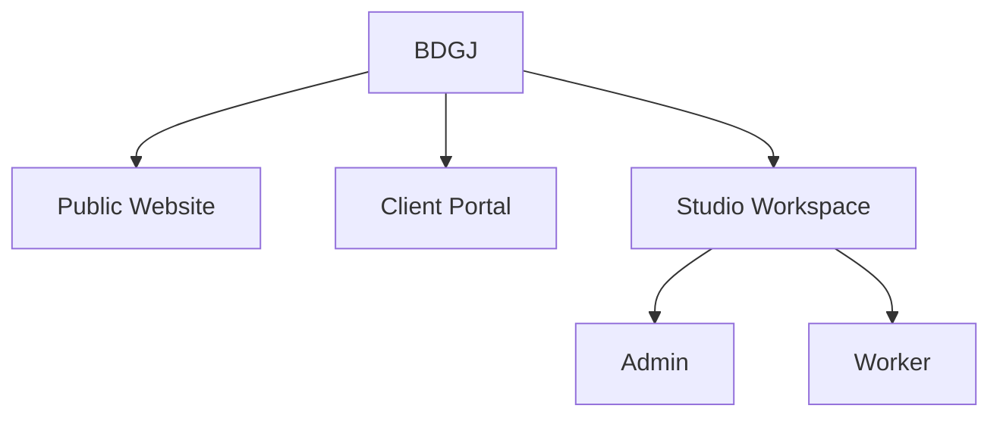
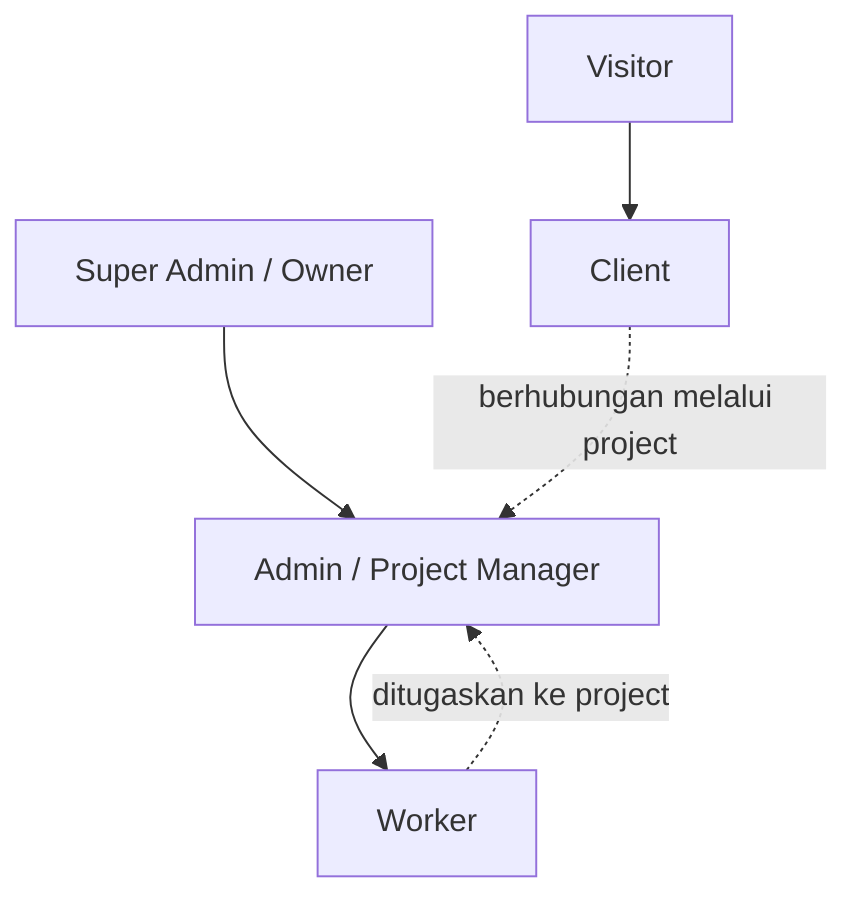
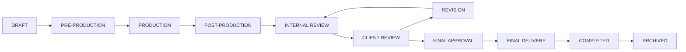
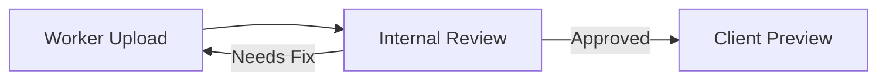
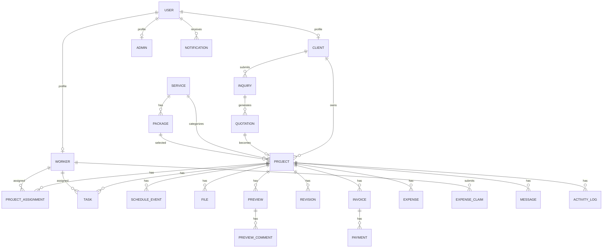
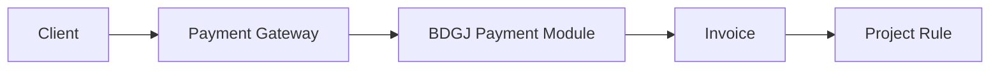
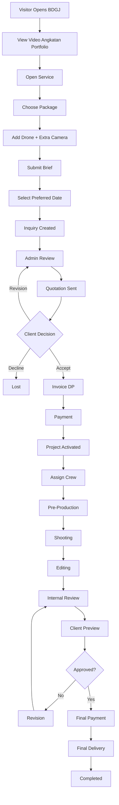

# BDGJ — System Blueprint

**Dokumen:** Blueprint Perancangan Website & Studio Management System BDGJ  
**Versi:** 1.0  
**Status:** Baseline Perancangan  
**Fokus:** Perancangan produk, role, alur bisnis, halaman, hak akses, data, status, notifikasi, keuangan, preview/revisi, dan aturan operasional.  
**Di luar dokumen ini:** tahapan pembuatan, tutorial coding, pemilihan framework, deployment, konfigurasi server, dan langkah implementasi teknis.

---

## 1. Ringkasan Konsep

BDGJ dirancang bukan hanya sebagai website company profile, tetapi sebagai **sistem operasional studio kreatif** yang menghubungkan tiga area utama:

1. **Public Website** — media branding, portfolio, layanan, dan akuisisi client.
2. **Client Portal** — area client untuk quotation, project, jadwal, pembayaran, preview, revisi, dan final files.
3. **Studio Workspace** — area internal BDGJ untuk admin dan worker dalam mengelola inquiry, project, produksi, tugas, timeline, file, revisi, dan finance.

Struktur produk utama:



Prinsip utama rancangan:

- Website publik harus terasa **cinematic, premium, creative-studio oriented**.
- Dashboard internal harus lebih **jelas, cepat, informatif, dan operasional** daripada eksperimental.
- Client hanya dapat melihat data miliknya sendiri.
- Worker hanya dapat melihat project yang ditugaskan kepadanya.
- Admin mengelola operasional.
- Super Admin/Owner memiliki akses tertinggi.
- Finance, file, revision, notification, dan activity log menjadi bagian dari satu project yang sama.
- Setiap project memiliki identitas unik dan histori yang dapat dilacak.

---

# 2. Tujuan Sistem

Sistem BDGJ harus dapat mendukung seluruh perjalanan bisnis studio dari calon client sampai project selesai.

Alur besar yang dituju:

```text
Visitor
→ Explore Portfolio
→ Choose Service
→ Submit Project Request
→ Admin Review
→ Quotation
→ Client Approval
→ Invoice / DP
→ Payment
→ Project Activation
→ Team Assignment
→ Pre-Production
→ Production
→ Post-Production
→ Client Preview
→ Revision
→ Approval
→ Final Payment
→ Final Delivery
→ Project Completed
```

Tujuan operasional:

- Mengurangi ketergantungan pada chat pribadi untuk pengelolaan project.
- Menyatukan data client, project, schedule, payment, revision, dan file.
- Memudahkan owner mengetahui kondisi bisnis secara cepat.
- Membatasi akses data berdasarkan role dan keterlibatan pada project.
- Memberikan client pengalaman yang profesional dari awal booking sampai file final.
- Memberikan worker ruang kerja yang fokus pada project dan tugas yang relevan.

---

# 3. Model Akses Sistem

BDGJ menggunakan empat level akses utama.

| Role | Scope Data | Fungsi Utama |
|---|---|---|
| Visitor | Public | Melihat website dan mengirim project request |
| Client | Own | Mengakses project miliknya |
| Worker | Assigned | Mengakses project yang ditugaskan kepadanya |
| Admin | Operational All | Mengelola operasional studio |
| Super Admin / Owner | System All | Mengelola seluruh sistem dan finance sensitif |

Definisi scope:

- **Public**: data memang diperbolehkan untuk ditampilkan publik.
- **Own**: user hanya dapat mengakses data yang menjadi miliknya.
- **Assigned**: worker hanya dapat mengakses project tempat ia ditugaskan.
- **Operational All**: admin dapat mengakses seluruh operasional yang menjadi tanggung jawab studio.
- **System All**: akses menyeluruh termasuk role, permission, finance sensitif, konfigurasi, dan audit.

---

# 4. Hierarki Role



## 4.1 Super Admin / Owner

Super Admin adalah pemilik hak akses tertinggi.

Dapat:

- melihat semua project;
- melihat semua client;
- melihat semua worker;
- melihat seluruh finance;
- melihat profit dan expense;
- mengelola admin;
- mengatur permission;
- mengelola payment configuration secara administratif;
- melihat activity log;
- mengubah pengaturan sistem;
- mengelola layanan, paket, portfolio, template komunikasi;
- melakukan override administratif yang tercatat di audit log.

Tidak disarankan menggunakan akun Super Admin untuk pekerjaan operasional sehari-hari bila tidak diperlukan.

---

## 4.2 Admin

Admin bertindak sebagai pusat operasional BDGJ.

Admin dapat:

- menerima inquiry;
- menghubungi calon client;
- membuat quotation;
- mengubah quotation;
- mengirim quotation;
- mengelola client;
- membuat atau mengaktifkan project;
- menetapkan worker;
- mengatur schedule;
- mengelola project status;
- membuat task;
- melihat file;
- melakukan internal review;
- mengirim preview ke client;
- menerima revision request;
- memantau invoice dan payment;
- mencatat expense sesuai permission;
- membuat laporan operasional;
- mengelola portfolio dan services jika diberikan permission.

Admin tidak harus memiliki seluruh permission sensitif milik Owner.

---

## 4.3 Client

Client adalah pihak pemesan jasa BDGJ.

Client dapat:

- melihat quotation miliknya;
- menerima quotation;
- meminta perubahan quotation;
- menolak quotation;
- melihat invoice;
- melakukan pembayaran;
- melihat project miliknya;
- melihat progress project;
- melihat schedule;
- membaca project brief;
- mengunggah referensi;
- melihat preview;
- memberi komentar;
- mengirim revision request;
- memilih foto;
- melihat final files;
- mengunduh file final yang telah dirilis;
- melihat riwayat komunikasi dan notifikasi project.

Client tidak dapat:

- melihat project client lain;
- melihat harga internal;
- melihat cost worker;
- melihat profit BDGJ;
- melihat internal note;
- melihat database worker secara penuh;
- mengubah status produksi secara langsung;
- mengakses file internal yang belum dirilis.

---

## 4.4 Worker

Worker adalah anggota produksi atau post-production yang ditugaskan ke project.

Contoh profesi:

- Photographer
- Videographer
- Director
- Assistant Director
- Drone Pilot
- Editor
- Colorist
- Motion Designer
- Animator
- VFX Artist
- Sound Designer
- Production Crew

**Profesi bukan role security terpisah.**  
Role security tetap `Worker`, sedangkan profesi menjadi atribut worker dan assignment pada project.

Worker dapat:

- melihat project yang ditugaskan;
- melihat brief yang relevan;
- melihat schedule;
- melihat contact person lapangan sesuai kebutuhan;
- melihat reference files;
- melihat task;
- memperbarui status task;
- mengunggah working file;
- mengunggah preview internal;
- mengirim hasil ke internal review;
- melihat revision yang ditugaskan;
- menandai revision sebagai selesai;
- membuat internal note;
- mengisi availability;
- mengajukan expense/reimbursement jika fitur tersebut diaktifkan.

Worker tidak dapat:

- melihat semua project BDGJ;
- melihat client database umum;
- melihat total revenue;
- melihat profit;
- melihat quotation final kecuali informasi tertentu diperlukan;
- melihat payment client;
- mengubah harga;
- mengubah invoice;
- menghapus project;
- mengubah role;
- merilis final file ke client tanpa otorisasi admin.

---

# 5. Batas Sistem Berdasarkan Role

```text
PUBLIC
└── Visitor

CLIENT AREA
└── Client

INTERNAL AREA
├── Worker
├── Admin
└── Super Admin
```

Aturan penting:

1. Login tidak otomatis memberi akses ke semua data.
2. Setiap halaman dan resource tetap tunduk pada permission.
3. Client memakai pola `own`.
4. Worker memakai pola `assigned`.
5. Admin memakai permission operasional.
6. Aksi sensitif harus terekam pada activity log.

---

# 6. Struktur Public Website

Arah visual public website mengikuti karakter creative studio modern:

- dark / cinematic;
- typography besar;
- project-first;
- image/video driven;
- motion sebagai aksen;
- konten tidak terlalu padat;
- CTA jelas menuju `Book a Project`.

## 6.1 Main Navigation

```text
HOME
WORKS
SERVICES
ABOUT
STUDIO
CONTACT

[ BOOK A PROJECT ]
```

## 6.2 Struktur Halaman

### Home

Isi utama:

- Hero
- Brand statement
- Selected Works
- Service overview
- Studio capability
- Short manifesto
- Client/testimonial
- CTA book project
- Footer

Contoh arah headline:

```text
BDGJ
PHOTO — FILM — POST PRODUCTION

WE CAPTURE STORIES.
```

atau:

```text
BDGJ VISUAL STUDIO
PHOTOGRAPHY / FILM / VFX / POST
```

---

### Works

Fungsi:

- memperlihatkan portfolio;
- filter berdasarkan kategori;
- membuka project detail;
- preview thumbnail;
- hover video preview bila relevan.

Kategori:

```text
ALL
FILM
WEDDING
GRADUATION
SCHOOL
COMMERCIAL
PHOTO
ANIMATION
VFX
POST-PRODUCTION
```

Project card dapat berisi:

- cover;
- title;
- category;
- year;
- short role/capability;
- optional preview video.

---

### Work Detail

Contoh data:

```text
Project Name
Category
Year
Client
Scope
Duration
Location
Team Credit
Description
Gallery
Film
Behind the Scene
Related Works
```

Tidak semua field wajib ditampilkan pada publik.

---

### Services

Struktur layanan dibuat fleksibel.

```text
Photography
├── Wedding Photography
├── Graduation
├── Event
├── Portrait
└── Commercial

Videography
├── Wedding Film
├── Graduation
├── Video Angkatan
├── Event
├── Company Profile
└── Music Video

Film Production
├── Short Film
├── Film TA
├── Commercial
└── Custom Film Production

Post Production
├── Video Editing
├── Color Grading
├── Sound Design
└── Photo Editing

VFX & Animation
├── Motion Graphics
├── 2D Animation
├── 3D Animation
├── CGI
└── Visual Effects
```

Setiap service dapat memiliki:

- title;
- slug;
- category;
- cover;
- description;
- deliverables;
- process summary;
- starting price atau `Contact`;
- packages;
- add-ons;
- portfolio related;
- FAQ;
- CTA.

---

### About

Isi:

- studio story;
- philosophy;
- capability;
- workflow overview;
- studio values;
- team preview;
- CTA.

---

### Studio

Isi:

- team;
- studio environment;
- equipment highlight bila ingin ditampilkan;
- creative capability;
- production fields.

---

### Contact

Isi:

- contact form;
- WhatsApp;
- email;
- social media;
- location/general service area;
- CTA menuju book project.

---

### Book a Project

Ini adalah pintu masuk transaksi.

Flow:

```text
Choose Service
→ Choose Package / Custom
→ Choose Add-On
→ Project Brief
→ Date Preference
→ Contact Data
→ Submit Inquiry
```

Visitor tidak diwajibkan membuat akun pada tahap awal.

---

# 7. Service & Package Model

## 7.1 Service

Service adalah jenis jasa utama.

Contoh:

```text
Video Angkatan
Wedding Film
Graduation Photography
Short Film
VFX Production
```

## 7.2 Package

Satu service dapat mempunyai beberapa package.

Contoh:

| Package | Example |
|---|---|
| Basic | Produksi sederhana |
| Cinematic | Crew dan output lebih lengkap |
| Premium | Produksi lebih besar |
| Custom | Harga dan kebutuhan khusus |

Field konseptual:

```text
Package Name
Service
Description
Starting Price
Deliverables
Crew Included
Duration
Revision Limit
Estimated Production Duration
Active / Inactive
```

## 7.3 Add-On

Contoh:

```text
Drone
Extra Camera
Extra Photographer
Extra Videographer
Motion Graphics
VFX
Additional Revision
Raw Files
Additional Shooting Hours
Express Editing
Transportation
```

Add-on dapat berupa:

- fixed price;
- quantity-based;
- custom quotation.

---

# 8. Inquiry / Project Request

Inquiry adalah permintaan project sebelum menjadi project aktif.

## 8.1 Data Inquiry

```text
Inquiry ID
Client Name
Email
Phone / WhatsApp
Institution / Company
Service
Package
Add-ons
Preferred Date
Alternative Date
Location
Project Brief
Reference Links
Reference Files
Estimated Budget
Notes
Source
Status
Assigned Admin
Created At
```

## 8.2 Inquiry Status

```text
NEW
CONTACTED
QUALIFIED
QUOTATION
WON
LOST
```

Definisi:

- `NEW`: baru masuk.
- `CONTACTED`: sudah dihubungi.
- `QUALIFIED`: kebutuhan cukup jelas dan layak ditindaklanjuti.
- `QUOTATION`: quotation telah/akan disusun.
- `WON`: client menerima penawaran.
- `LOST`: inquiry tidak berlanjut.

---

# 9. Quotation

Quotation adalah penawaran komersial sebelum project aktif.

## 9.1 Isi Quotation

```text
Quotation Number
Client
Inquiry Reference
Project Name
Service
Package
Custom Items
Add-ons
Crew
Equipment
Transportation
Discount
Tax
Subtotal
Grand Total
DP Requirement
Remaining Payment
Validity Period
Terms
Notes
Status
```

## 9.2 Quotation Status

```text
DRAFT
SENT
VIEWED
REVISION_REQUESTED
ACCEPTED
DECLINED
EXPIRED
CANCELLED
```

## 9.3 Aksi Client

```text
ACCEPT QUOTATION
REQUEST REVISION
DECLINE
```

## 9.4 Aturan

- Quotation dapat memiliki version.
- Perubahan harga harus menghasilkan history.
- Client hanya melihat quotation miliknya.
- Quotation yang diterima menjadi basis nilai kontrak project.
- Setelah quotation diterima, inquiry menjadi `WON`.
- Setelah quotation diterima, Client Portal dapat diaktifkan.

---

# 10. Aktivasi Akun Client

Client tidak diwajibkan login sebelum inquiry.

Flow akun:

```text
Visitor
→ Inquiry
→ Quotation
→ Accept Quotation
→ Client Account Activated / Invited
→ Client Portal
```

Tujuan:

- mengurangi friksi saat calon client baru ingin bertanya atau meminta quotation;
- membuat login menjadi relevan ketika sudah ada hubungan project nyata.

Data client:

```text
Client ID
Name
Email
Phone
Company / Institution
Billing Information
Projects
Invoices
Activity
Account Status
```

---

# 11. Payment & Invoice

## 11.1 Payment Model

Payment tidak berdiri sendiri. Payment selalu terkait dengan invoice.

```text
Project
└── Invoice
    └── Payment Transaction
```

Satu project dapat memiliki:

- DP invoice;
- progress payment;
- final payment;
- additional invoice.

## 11.2 Invoice Status

```text
DRAFT
ISSUED
PARTIALLY_PAID
PAID
OVERDUE
VOID
REFUNDED
```

## 11.3 Internal Payment Status

Gateway eksternal dapat memiliki banyak status. Sistem BDGJ menggunakan status internal yang lebih konsisten:

```text
UNPAID
PENDING
PAID
FAILED
EXPIRED
REFUNDED
PARTIALLY_REFUNDED
```

Mapping status gateway ke status internal menjadi tanggung jawab layer integrasi, sedangkan dashboard BDGJ tetap memakai status internal.

## 11.4 Payment Rules

- Redirect browser bukan satu-satunya sumber kebenaran payment.
- Status payment harus dapat berubah setelah transaksi dibuat.
- Setiap perubahan status payment dicatat.
- Project tidak dianggap aktif hanya berdasarkan screenshot pembayaran.
- Admin dapat melakukan rekonsiliasi manual dengan audit trail bila diperlukan.
- Refund harus mempunyai alasan dan history.

---

# 12. Project Creation

Project dibuat ketika business rule aktivasi terpenuhi.

Kondisi umum:

```text
Quotation Accepted
+
DP Requirement Satisfied
=
Project Active
```

Tidak semua project harus memiliki aturan DP yang sama; dapat disesuaikan per quotation.

Project ID contoh:

```text
BDGJ-2026-0048
```

## 12.1 Data Project

```text
Project ID
Project Name
Client
Service
Package
Quotation
Contract Value
Start Date
Shoot Date
Deadline
Location
Brief
Project Status
Production Status
Payment Summary
Assigned Admin
Assigned Workers
Tasks
Files
Preview
Revision
Invoice
Expense
Activity
```

---

# 13. Project Lifecycle



Internal status:

```text
DRAFT
PRE_PRODUCTION
PRODUCTION
POST_PRODUCTION
INTERNAL_REVIEW
CLIENT_REVIEW
REVISION
FINAL_APPROVAL
FINAL_DELIVERY
COMPLETED
ARCHIVED
CANCELLED
```

---

# 14. Project Page

Project menjadi pusat seluruh informasi.

Struktur tab:

```text
Overview
Brief
Timeline
Schedule
Team
Tasks
Files
Preview
Revision
Finance
Communication
Activity
```

Tab tertentu hanya muncul sesuai role dan permission.

---

# 15. Client Portal

## 15.1 Sidebar Client

```text
BDGJ

Dashboard
My Projects
Quotations
Invoices & Payments
Schedule
Preview & Revision
Files
Messages
Notifications

────────────

Profile
Help
Logout
```

---

## 15.2 Client Dashboard

Widget utama:

```text
Active Projects
Waiting for Review
Payment Due
Next Shoot
Unread Notifications
Recent Files
```

Contoh project card:

```text
BDGJ-2026-0048
Graduation Film

PRE-PRODUCTION   ✓
SHOOTING         ✓
EDITING          ●
REVIEW           ○
FINAL            ○
```

CTA dinamis:

```text
Pay Invoice
Review Preview
Submit Revision
Download Final
View Schedule
```

---

## 15.3 My Projects

List:

| Field | Isi |
|---|---|
| Project | Nama project |
| Project ID | ID unik |
| Service | Jenis layanan |
| Status | Stage project |
| Progress | Ringkasan |
| Next Activity | Event berikutnya |
| Payment | Ringkasan invoice |

Filter:

```text
ACTIVE
WAITING REVIEW
COMPLETED
ARCHIVED
```

---

## 15.4 Client Project Detail

Client dapat melihat:

```text
Overview
Timeline
Schedule
Brief
Files Shared With Client
Preview
Revision
Invoice
Payment
Messages
Activity Client-Facing
```

Client tidak melihat:

```text
Internal Expense
Worker Cost
Internal Note
Private Draft
Profit
Admin Activity Sensitif
```

---

# 16. Admin Portal

## 16.1 Sidebar Admin

```text
BDGJ ADMIN

Dashboard

Sales
├── Inquiries
├── Quotations
└── Clients

Projects
├── All Projects
├── Production Board
├── Calendar
└── Revisions

Team
├── Workers
├── Assignments
└── Availability

Finance
├── Overview
├── Transactions
├── Invoices
├── Expenses
└── Reports

Content
├── Portfolio
├── Services
├── Packages
├── Add-ons
└── Testimonials

Communication
├── Messages
├── Notifications
└── Templates

System
├── Users & Roles
├── Activity Log
├── Integrations
└── Settings
```

Beberapa item dapat disembunyikan dari Admin biasa bila hanya boleh diakses Super Admin.

---

## 16.2 Admin Dashboard

Dashboard harus bersifat **action-oriented**.

### Summary Cards

```text
New Inquiries
Quotation Waiting
Quotation Accepted
Active Projects
Client Review Waiting
Revisions Open
Invoices Due
Today Shoots
```

### Finance Summary

Berdasarkan permission:

```text
Revenue This Month
Cash Received
Outstanding
Project Expense
Estimated Gross Profit
```

### Operational Sections

```text
Today's Schedule
Upcoming Production
Overdue Tasks
Waiting Client Approval
Payment Attention
Worker Conflict
Recent Activity
```

---

# 17. Sales / CRM

## 17.1 Inquiry Pipeline

Board:

```text
NEW
CONTACTED
QUALIFIED
QUOTATION
WON
LOST
```

Inquiry card:

```text
Client
Service
Estimated Budget
Preferred Date
Source
Assigned Admin
Last Activity
```

## 17.2 Client Directory

Admin dapat melihat:

```text
Client Name
Contact
Institution
Total Projects
Active Projects
Last Project
Outstanding Invoice
Status
```

Client detail:

```text
Profile
Projects
Quotations
Invoices
Communication
Files Shared
Activity
```

---

# 18. Production Board

Admin dapat melihat project sebagai Kanban.

```text
PRE-PRODUCTION
│
├── Project A
└── Project B

PRODUCTION
│
└── Project C

POST-PRODUCTION
│
├── Project D
└── Project E

CLIENT REVIEW
│
└── Project F

REVISION
│
└── Project G

FINAL
│
└── Project H

COMPLETED
│
└── Project I
```

Card menampilkan:

```text
Project
Client
Deadline
Assigned Admin
Key Workers
Progress
Payment Alert
Revision Alert
```

---

# 19. Worker Management

Worker profile:

```text
Worker ID
Name
Email
Phone
Profession
Secondary Skills
Availability
Active Projects
Workload
Employment Type
Status
Notes
```

Employment type contoh:

```text
INTERNAL
FREELANCE
PARTNER
```

Tidak memengaruhi security role kecuali permission khusus diberikan.

---

# 20. Team Assignment

Project dapat mempunyai banyak worker.

Contoh:

| Worker | Project Role |
|---|---|
| Budi | Director |
| Andi | Videographer |
| Rama | Photographer |
| Rizky | Drone Pilot |
| Fajar | Editor |
| Akbar | Colorist |

Assignment menyimpan:

```text
Project
Worker
Project Role
Assignment Date
Start
End
Notes
Status
```

Worker hanya mendapat akses ke project setelah assignment aktif.

Jika assignment berakhir atau worker dilepas, akses project dapat dicabut sesuai kebijakan.

---

# 21. Worker Portal

## 21.1 Sidebar Worker

```text
BDGJ WORKSPACE

Dashboard
My Projects
My Tasks
Schedule
Revisions
Files
Availability
Expense Claims
Notifications

────────────

Profile
Logout
```

---

## 21.2 Worker Dashboard

Widget:

```text
Active Projects
Tasks Today
Tasks Overdue
Revision Assigned
Upcoming Shoot
Deadline This Week
Pending Internal Review
```

---

## 21.3 My Projects

Worker hanya melihat project yang assigned.

Project detail worker:

```text
Overview
Brief
Schedule
Team
My Tasks
Relevant Files
Internal Notes
Client Feedback
Revision Assigned
```

Tidak menampilkan finance client.

---

# 22. Task Management

Task digunakan untuk memecah pekerjaan project.

Contoh:

```text
Import Footage
Rough Cut
Sound Design
Color Grade
Motion Graphics
Internal Review
Client Preview
Revision 01
Final Export
```

## 22.1 Task Fields

```text
Task ID
Project
Title
Description
Assignee
Reviewer
Priority
Status
Start Date
Due Date
Dependencies
Attachments
Comments
Created By
```

## 22.2 Task Status

```text
TODO
IN_PROGRESS
REVIEW
BLOCKED
DONE
CANCELLED
```

## 22.3 Worker Capabilities

Worker dapat:

- memulai task;
- mengubah status task miliknya;
- menambahkan progress note;
- mengunggah hasil;
- menandai blocked;
- meminta review;
- menyelesaikan task sesuai permission.

Worker tidak dapat memindahkan stage project utama tanpa hak admin.

---

# 23. Schedule & Calendar

Calendar harus mencakup:

```text
Shoot
Meeting
Pre-Production
Editing Deadline
Client Review Deadline
Revision Deadline
Final Delivery
Worker Availability
```

Event field:

```text
Event Title
Project
Type
Date
Start Time
End Time
Location
Assigned Team
Client Visibility
Notes
Status
```

## 23.1 Public Availability

Public Book Project dapat memperlihatkan status sederhana:

```text
AVAILABLE
LIMITED
UNAVAILABLE
```

Public availability tidak harus memperlihatkan detail project lain.

Client memilih:

- preferred date;
- alternative date.

Tanggal belum dianggap final sampai disetujui Admin.

---

# 24. File Management

File dibagi berdasarkan scope.

```text
PROJECT FILES
├── Client Reference
├── Internal Working Files
├── Raw Media
├── Internal Preview
├── Client Preview
├── Revision
└── Final Delivery
```

## 24.1 File Visibility

Setiap file memiliki visibility:

```text
INTERNAL_ONLY
ASSIGNED_WORKERS
CLIENT_SHARED
FINAL_CLIENT
```

## 24.2 File Metadata

```text
File ID
Project
Name
Type
Category
Version
Uploader
Visibility
Status
Size
Created At
Notes
```

## 24.3 File Version

Preview dan deliverable harus mendukung versi:

```text
V1
V2
V3
FINAL
FINAL-REV1
```

Versi lama tidak harus hilang dari internal history.

---

# 25. Video Preview

Video preview adalah fitur inti untuk project film/video.

Client mendapatkan player:

```text
┌───────────────────────────────────┐
│                                   │
│             VIDEO                 │
│                                   │
└───────────────────────────────────┘

00:00 ───────────────────── 06:42
```

Client dapat menambahkan komentar berdasarkan timestamp.

Contoh:

```text
02:13
"Ganti shot ini dengan drone."

03:41
"Bagian ini terlalu gelap."

05:02
"Nama guru salah."
```

Comment field:

```text
Preview
Timestamp
Author
Comment
Status
Reply
Created At
Resolved At
```

Status:

```text
OPEN
IN_PROGRESS
RESOLVED
REJECTED
```

---

# 26. Photo Gallery & Selection

Photo project dapat menggunakan private client gallery.

Fitur client:

```text
View
Favorite
Select
Comment
Compare
```

Use case:

```text
Select 50 Photos for Final Edit
```

Gallery dapat menyimpan:

```text
Total Photos
Selection Limit
Selected Count
Deadline
Selection Status
```

Selection status:

```text
NOT_STARTED
IN_PROGRESS
SUBMITTED
LOCKED
```

---

# 27. Revision System

Revision tidak diperlakukan sebagai chat biasa.

## 27.1 Revision Round

```text
Revision #1
Revision #2
Revision #3
```

Revision mempunyai:

```text
Revision ID
Project
Preview Version
Round Number
Requested By
Requested At
Due Date
Items
Assigned Worker
Status
Completed At
Client Approval
```

## 27.2 Revision Status

```text
REQUESTED
TRIAGE
IN_PROGRESS
INTERNAL_REVIEW
READY_FOR_CLIENT
APPROVED
CLOSED
```

## 27.3 Revision Limit

Package dapat menentukan:

```text
Included Revision: 2 rounds
Used: 1
Remaining: 1
```

Revision tambahan dapat menghasilkan quotation/invoice tambahan sesuai kebijakan studio.

---

# 28. Internal Review

Worker tidak otomatis mengirim hasil ke client.

Flow:



Tujuan:

- menjaga quality control;
- mencegah draft belum siap terlihat client;
- menjaga komunikasi tetap terkendali.

---

# 29. Communication Model

Komunikasi dibagi menjadi dua scope.

## 29.1 Internal Note

Terlihat oleh:

```text
Admin
Assigned Worker
```

Tidak terlihat client.

Contoh:

```text
"Color terlalu warm, revisi sebelum kirim client."
"Footage drone belum masuk."
"Jangan publish versi ini."
```

## 29.2 Client Thread

Terlihat oleh:

```text
Client
Admin
```

Worker dapat melihat atau membalas hanya bila project permission mengizinkan.

Default yang direkomendasikan:

- Client ↔ Admin menjadi komunikasi utama.
- Worker menerima client feedback yang relevan melalui project/revision.
- Direct worker-to-client tidak menjadi jalur default.

---

# 30. Notification Center

Channel:

```text
IN-APP
EMAIL
WHATSAPP
```

Notifikasi tidak boleh menggantikan data utama di dashboard.  
Notifikasi hanya mengarahkan user kembali ke resource di sistem.

## 30.1 Trigger Matrix

| Event | Client | Admin | Worker |
|---|---:|---:|---:|
| New Inquiry | — | ✓ | — |
| Inquiry Assigned | — | ✓ | — |
| Quotation Sent | ✓ | ✓ | — |
| Quotation Viewed | — | ✓ | — |
| Quotation Revision Requested | — | ✓ | — |
| Quotation Accepted | ✓ | ✓ | — |
| Invoice Issued | ✓ | ✓ | — |
| Payment Pending | ✓ | ✓ | — |
| Payment Received | ✓ | ✓ | — |
| Project Activated | ✓ | ✓ | Assigned |
| Worker Assigned | — | ✓ | ✓ |
| Schedule Created | Relevant | ✓ | Relevant |
| Shoot Reminder | ✓ | ✓ | ✓ |
| Task Assigned | — | ✓ | ✓ |
| Preview Internal Ready | — | ✓ | Relevant |
| Client Preview Ready | ✓ | ✓ | — |
| Revision Requested | — | ✓ | Relevant |
| Revision Ready | ✓ | ✓ | Relevant |
| Final Payment Due | ✓ | ✓ | — |
| Final File Released | ✓ | ✓ | — |
| Project Completed | ✓ | ✓ | Relevant |

---

# 31. Finance Dashboard

Finance harus dapat menjawab empat pertanyaan:

1. Berapa nilai project?
2. Berapa uang yang sudah masuk?
3. Berapa biaya project?
4. Berapa margin/profit project secara estimasi atau final?

## 31.1 Overview Metrics

```text
Total Contract Value
Cash Received
Outstanding
Overdue
Project Expense
Estimated Gross Profit
Average Project Value
```

## 31.2 Breakdown

```text
Revenue by Month
Revenue by Service
Revenue by Client Type
Payment Status
Expense by Category
Profit by Project
Outstanding Invoice
```

---

# 32. Project Finance

Contoh:

```text
PROJECT VALUE
Rp 15.000.000

PAYMENT
DP                     Rp 7.500.000
Remaining              Rp 7.500.000

EXPENSE
Videographer           Rp 1.500.000
Photographer           Rp 1.200.000
Drone                  Rp   800.000
Transport              Rp   500.000

TOTAL COST             Rp 4.000.000

ESTIMATED GROSS PROFIT
Rp 11.000.000
```

## 32.1 Expense Categories

```text
Crew
Equipment Rental
Transportation
Accommodation
Meals
Location
Talent
Music / License
Asset Purchase
Freelancer
Printing
Miscellaneous
```

## 32.2 Expense Status

```text
DRAFT
SUBMITTED
APPROVED
REJECTED
PAID
```

---

# 33. Worker Expense Claim

Worker dapat mengajukan expense tanpa melihat finance project.

Form:

```text
Project
Date
Category
Amount
Description
Receipt
Notes
```

Flow:

```text
Worker Submit
→ Admin Review
→ Approved / Rejected
→ Finance Record
```

Worker hanya melihat claim miliknya.

---

# 34. Finance Access Rules

| Data | Owner | Admin Finance | Admin Project | Worker | Client |
|---|---:|---:|---:|---:|---:|
| Contract Value | ✓ | ✓ | Optional | ✕ | Own |
| Payment Received | ✓ | ✓ | Optional | ✕ | Own |
| Outstanding | ✓ | ✓ | Optional | ✕ | Own |
| Expense | ✓ | ✓ | Optional | Own Claim | ✕ |
| Profit | ✓ | Permission | ✕ | ✕ | ✕ |
| Worker Cost | ✓ | Permission | Limited | Own if allowed | ✕ |

---

# 35. Content Management

Admin yang memiliki permission dapat mengelola:

```text
Portfolio
Services
Packages
Add-ons
Testimonials
Home Featured Projects
Studio Team Display
FAQ
Contact Information
```

Portfolio management:

```text
Title
Category
Cover
Gallery
Preview Video
Description
Credits
Client Display Name
Year
Featured
Visibility
SEO Metadata
```

---

# 36. Users & Roles

User record:

```text
User ID
Name
Email
Phone
Role
Status
Last Login
Created At
```

Status:

```text
INVITED
ACTIVE
SUSPENDED
DISABLED
```

## 36.1 Permission Model

Role adalah baseline.  
Permission dapat mempersempit atau memperluas akses yang memang diizinkan untuk role tersebut.

Contoh permission:

```text
project.view_all
project.create
project.update
project.delete
project.assign_worker

finance.view
finance.view_profit
finance.create_expense

quotation.create
quotation.send
quotation.approve_discount

content.manage_portfolio

user.manage_worker
user.manage_admin

system.manage_integrations
```

Worker dan Client tetap tunduk pada scope relationship (`assigned` / `own`) meskipun mempunyai permission fitur tertentu.

---

# 37. Permission Matrix

| Feature | Super Admin | Admin | Client | Worker |
|---|---:|---:|---:|---:|
| Public Portfolio | CRUD | Permission | View | View |
| Services | CRUD | Permission | View | View |
| Inquiry | All | All/Assigned | Own | — |
| Quotation | All | CRUD | Own | — |
| Client Directory | All | ✓ | Own Profile | — |
| Project | All | All | Own | Assigned |
| Schedule | All | All | Own | Assigned |
| Team | All | Manage | Project View | Assigned Project |
| Task | All | All | Limited View | Assigned |
| Internal Notes | All | ✓ | ✕ | Assigned |
| Client Messages | All | ✓ | Own | Limited |
| Preview | All | All | Own | Assigned |
| Revision | All | All | Own | Assigned |
| Final Files | All | Release | Own Released | Assigned Working |
| Invoice | All | Permission | Own | ✕ |
| Payment | All | Permission | Own | ✕ |
| Expense | All | Permission | ✕ | Own Claim |
| Profit | ✓ | Permission | ✕ | ✕ |
| Worker Management | ✓ | ✓ | ✕ | Own Profile |
| User Roles | ✓ | Limited | ✕ | ✕ |
| Activity Log | ✓ | Permission | Limited Own | Limited Own |
| Settings | ✓ | Permission | ✕ | ✕ |

---

# 38. Activity Log

Activity log mencatat perubahan penting.

Contoh:

```text
14:02
Admin changed project:
POST_PRODUCTION → CLIENT_REVIEW

13:46
Fajar uploaded:
Wedding-V3.mp4

12:30
Client submitted:
Revision #2

10:15
Payment status:
PENDING → PAID
```

Event yang wajib dicatat secara konseptual:

```text
Login / Security Event
Role Change
Permission Change
Quotation Change
Quotation Acceptance
Invoice Change
Payment Status Change
Project Status Change
Worker Assignment
File Upload
File Release
Revision Request
Revision Resolution
Expense Approval
Project Completion
Critical Setting Change
```

---

# 39. Dashboard per Role

## 39.1 Client

Prioritas:

```text
What do I need to do now?
What is the project status?
Do I need to pay?
Is there something to review?
When is the next schedule?
Where are my files?
```

## 39.2 Worker

Prioritas:

```text
What should I work on today?
Which project am I assigned to?
What is the deadline?
Is there a revision?
What should I upload?
```

## 39.3 Admin

Prioritas:

```text
What needs attention?
Which client is waiting?
Which project is blocked?
Which worker is overloaded?
Which invoice is due?
Which preview needs review?
```

## 39.4 Owner

Prioritas:

```text
How is the studio performing?
How much revenue is collected?
How much is outstanding?
Which projects are profitable?
Which service performs best?
What operational risks exist?
```

---

# 40. Navigation / URL Concept

Ini hanya struktur informasi, bukan petunjuk implementasi.

## Public

```text
/
 /works
 /works/{slug}
 /services
 /services/{slug}
 /about
 /studio
 /contact
 /book
```

## Client

```text
/client
/client/projects
/client/projects/{id}
/client/quotations
/client/invoices
/client/schedule
/client/revisions
/client/files
/client/messages
/client/notifications
/client/profile
```

## Worker

```text
/workspace
/workspace/projects
/workspace/projects/{id}
/workspace/tasks
/workspace/schedule
/workspace/revisions
/workspace/files
/workspace/availability
/workspace/expenses
/workspace/notifications
```

## Admin

```text
/admin
/admin/inquiries
/admin/quotations
/admin/clients

/admin/projects
/admin/projects/{id}
/admin/production
/admin/calendar
/admin/revisions

/admin/workers
/admin/assignments
/admin/availability

/admin/finance
/admin/finance/transactions
/admin/finance/invoices
/admin/finance/expenses
/admin/finance/reports

/admin/content/portfolio
/admin/content/services
/admin/content/packages
/admin/content/addons
/admin/content/testimonials

/admin/messages
/admin/notifications
/admin/templates

/admin/users
/admin/activity
/admin/integrations
/admin/settings
```

---

# 41. Conceptual Data Model



---

# 42. Core Entity List

Entity inti:

```text
users
clients
workers
admins

services
packages
addons

inquiries
quotations
quotation_items

projects
project_assignments
tasks
schedule_events

files
previews
preview_comments
photo_selections
revisions
revision_items

invoices
payments
expenses
expense_claims

messages
notifications
activity_logs

portfolios
portfolio_media
testimonials
```

Dokumen ini hanya menetapkan relasi konseptual, bukan struktur database final atau tipe kolom implementasi.

---

# 43. Status Dictionary

## Inquiry

```text
NEW
CONTACTED
QUALIFIED
QUOTATION
WON
LOST
```

## Quotation

```text
DRAFT
SENT
VIEWED
REVISION_REQUESTED
ACCEPTED
DECLINED
EXPIRED
CANCELLED
```

## Invoice

```text
DRAFT
ISSUED
PARTIALLY_PAID
PAID
OVERDUE
VOID
REFUNDED
```

## Payment

```text
UNPAID
PENDING
PAID
FAILED
EXPIRED
REFUNDED
PARTIALLY_REFUNDED
```

## Project

```text
DRAFT
PRE_PRODUCTION
PRODUCTION
POST_PRODUCTION
INTERNAL_REVIEW
CLIENT_REVIEW
REVISION
FINAL_APPROVAL
FINAL_DELIVERY
COMPLETED
ARCHIVED
CANCELLED
```

## Task

```text
TODO
IN_PROGRESS
REVIEW
BLOCKED
DONE
CANCELLED
```

## Revision

```text
REQUESTED
TRIAGE
IN_PROGRESS
INTERNAL_REVIEW
READY_FOR_CLIENT
APPROVED
CLOSED
```

## Worker

```text
ACTIVE
INACTIVE
ON_LEAVE
```

---

# 44. Business Rules

## 44.1 Inquiry

- Inquiry dapat dibuat tanpa akun.
- Satu inquiry dapat mempunyai lebih dari satu quotation version.
- Inquiry hanya menjadi project setelah kondisi bisnis yang ditentukan terpenuhi.

## 44.2 Quotation

- Harga yang diterima client harus memiliki snapshot/history.
- Perubahan setelah acceptance harus dapat dilacak.
- Quotation tidak dapat diam-diam berubah tanpa revision history.

## 44.3 Client

- Client hanya dapat melihat data miliknya.
- Account client dapat diaktifkan setelah quotation accepted.
- Satu client dapat memiliki banyak project.

## 44.4 Project

- Project selalu mempunyai client.
- Project dapat mempunyai banyak worker.
- Worker tidak otomatis memiliki akses ke project lain.
- Project stage utama dikendalikan Admin.

## 44.5 Task

- Task selalu terkait project.
- Task dapat memiliki assignee.
- Task worker tidak memberi hak untuk melihat finance.

## 44.6 Preview

- Draft internal tidak terlihat client.
- Preview client harus memiliki status release/approved.
- Komentar video dapat terikat timestamp.

## 44.7 Revision

- Revision mempunyai round.
- Revision dapat mempunyai limit dari package.
- Revision tambahan dapat menjadi billable.

## 44.8 Final Files

- Final file hanya terlihat client setelah dirilis.
- File yang belum dirilis tetap internal.
- Release final dapat dipengaruhi oleh payment rule project.

## 44.9 Payment

- Status payment bersifat stateful.
- Payment dapat berubah dari pending menjadi paid/failed/expired.
- Status final harus tercatat pada history.

## 44.10 Finance

- Worker tidak melihat profit.
- Client tidak melihat internal expense.
- Admin finance permission dapat dipisah dari admin project.

---

# 45. Security & Access Design Principles

Perancangan authorization BDGJ mengikuti prinsip:

```text
DENY BY DEFAULT
LEAST PRIVILEGE
ROLE + RESOURCE RELATIONSHIP
SERVER-SIDE AUTHORIZATION CONCEPT
AUDIT SENSITIVE ACTIONS
```

Dalam konteks produk:

- Client tidak dapat mengakses project hanya dengan menebak ID.
- Worker harus assigned sebelum dapat melihat project.
- Hidden menu bukan pengganti permission.
- Permission dicek terhadap aksi dan resource.
- Admin permission dapat dipisah.
- Finance sensitif dapat dibatasi ke Owner.
- Semua perubahan penting tercatat.
- File visibility harus mengikuti aturan yang sama dengan project visibility.

---

# 46. Privacy Boundary

Informasi yang dianggap sensitif:

```text
Client Contact
Billing Data
Project Brief
Private Media
Raw Footage
Internal Preview
Finance
Worker Cost
Profit
Internal Notes
System Activity
```

Public website hanya menampilkan project/media yang memang ditandai untuk publikasi.

Portfolio tidak otomatis mengambil seluruh project client.

Project selesai belum berarti boleh dipublikasikan sebagai portfolio.

Harus terdapat konsep:

```text
PORTFOLIO_PERMISSION
PUBLIC
PRIVATE
PENDING_APPROVAL
```

---

# 47. Payment Integration Boundary

Blueprint tidak mengikat BDGJ pada satu vendor payment gateway.

Sistem hanya membutuhkan interface konseptual:

```text
Create Payment
Receive Payment Status
Check Payment Status
Handle Expiry
Handle Failure
Handle Refund
Store Transaction Reference
```

Gateway eksternal berkomunikasi dengan module payment, kemudian module payment memperbarui status internal.



---

# 48. WhatsApp & Email Boundary

Notifikasi WhatsApp dan email diperlakukan sebagai channel komunikasi.

```text
Notification Event
→ Template
→ Channel
→ Recipient
→ Delivery Status
```

Data yang disimpan secara konseptual:

```text
Notification
Recipient
Channel
Template
Related Resource
Delivery Status
Sent At
Read At
```

Delivery status contoh:

```text
QUEUED
SENT
DELIVERED
FAILED
READ
```

Tidak semua provider mendukung semua status; dashboard dapat menampilkan status yang tersedia.

---

# 49. Search, Filter, and Sorting

Admin membutuhkan pencarian lintas operasional.

Search target:

```text
Project ID
Project Name
Client Name
Phone
Email
Quotation Number
Invoice Number
Worker
```

Filter project:

```text
Status
Service
Client
Assigned Admin
Worker
Date
Payment Status
Revision Status
```

Filter finance:

```text
Date
Client
Project
Payment Status
Invoice Status
Expense Category
```

---

# 50. Empty, Warning, and Attention States

Dashboard harus membedakan:

```text
Normal
Needs Attention
Blocked
Overdue
Waiting Client
Waiting Admin
Waiting Worker
Waiting Payment
```

Contoh attention center admin:

```text
3 quotations belum dijawab > 3 hari
2 task overdue
1 shoot belum punya videographer
4 invoice jatuh tempo
2 client menunggu preview
1 revision deadline hari ini
```

---

# 51. Approval Responsibilities

| Aksi | Worker | Admin | Client | Owner |
|---|---:|---:|---:|---:|
| Submit Inquiry | — | — | ✓ | — |
| Create Quotation | — | ✓ | — | ✓ |
| Accept Quotation | — | — | ✓ | — |
| Assign Worker | — | ✓ | — | ✓ |
| Update Task | ✓ | ✓ | — | ✓ |
| Move Project Stage | Limited | ✓ | — | ✓ |
| Upload Internal Preview | ✓ | ✓ | — | ✓ |
| Release Client Preview | — | ✓ | — | ✓ |
| Request Revision | — | — | ✓ | — |
| Resolve Revision Item | ✓ | ✓ | — | ✓ |
| Approve Revision Delivery | — | ✓ | ✓ final approval | ✓ |
| Release Final File | — | ✓ | — | ✓ |
| Record Expense | Claim | ✓ | — | ✓ |
| View Profit | — | Permission | — | ✓ |

---

# 52. Project Timeline Example

```text
12 Aug — Inquiry Submitted
12 Aug — Admin Contacted Client
13 Aug — Quotation Sent
14 Aug — Quotation Accepted
14 Aug — DP Invoice Issued
14 Aug — Payment Received
15 Aug — Project Activated
16 Aug — Team Assigned
18 Aug — Pre-Production Meeting
21 Aug — Shooting
22 Aug — Post-Production Started
28 Aug — Internal Review
29 Aug — Client Preview V1
30 Aug — Revision #1 Requested
02 Sep — Preview V2
03 Sep — Client Approved
03 Sep — Final Invoice
04 Sep — Final Payment
04 Sep — Final File Released
05 Sep — Project Completed
```

Timeline berfungsi sebagai histori, bukan sekadar jadwal.

---

# 53. Example End-to-End Flow

## Case: Video Angkatan SMA



---

# 54. Public vs Portal UX Direction

## Public Website

Prioritas:

```text
Emotion
Brand
Visual Storytelling
Portfolio
Trust
Conversion
```

Karakter:

- cinematic;
- editorial;
- motion-heavy secukupnya;
- large typography;
- high-impact photo/video;
- minimal navigation.

## Client Portal

Prioritas:

```text
Clarity
Progress
Action
Payment
Review
Delivery
```

Karakter:

- clean;
- premium;
- lebih tenang;
- progress-oriented;
- sedikit motion;
- informasi jelas.

## Admin / Worker

Prioritas:

```text
Speed
Density
Status
Task
Schedule
Attention
```

Karakter:

- dashboard-oriented;
- navigasi jelas;
- tabel/Kanban/calendar;
- minim efek dekoratif;
- lebih fokus ke produktivitas.

---

# 55. Naming Convention

Nama user-facing yang disarankan:

```text
Book a Project
Project Request
Quotation
My Projects
Project Timeline
Client Preview
Revision
Final Delivery
Production Board
Studio Workspace
```

Hindari istilah teknis pada Client Portal bila tidak perlu.

Contoh:

`Payment Callback` tidak perlu terlihat client.  
Tampilkan sebagai `Payment Status`.

---

# 56. System Boundary Summary

## Public Website bertanggung jawab untuk:

```text
Branding
Portfolio
Services
Lead Generation
Project Request
```

## Client Portal bertanggung jawab untuk:

```text
Quotation
Project Visibility
Schedule
Payment
Preview
Revision
Final File
Communication
```

## Admin Portal bertanggung jawab untuk:

```text
CRM
Quotation
Project Operations
Worker Assignment
Schedule
Quality Control
Finance
Content
Communication
System Administration
```

## Worker Portal bertanggung jawab untuk:

```text
Assigned Project
Task
Schedule
Files
Internal Review Submission
Revision
Availability
Expense Claim
```

---

# 57. Final Master Flow

```text
PUBLIC WEBSITE
│
├── Home
├── Works
├── Services
├── About
├── Studio
├── Contact
│
└── BOOK A PROJECT
        │
        ▼
   SELECT SERVICE
        │
   SELECT PACKAGE
        │
      ADD-ONS
        │
   PROJECT BRIEF
        │
   DATE PREFERENCE
        │
      INQUIRY
        │
   ADMIN REVIEW
        │
     QUOTATION
        │
  CLIENT DECISION
        │
      ACCEPT
        │
    DP INVOICE
        │
     PAYMENT
        │
 PROJECT ACTIVATED
        │
   ASSIGN WORKER
        │
 PRE-PRODUCTION
        │
    PRODUCTION
        │
 POST-PRODUCTION
        │
 INTERNAL REVIEW
        │
  CLIENT PREVIEW
        │
     REVISION
        │
 CLIENT APPROVAL
        │
 FINAL PAYMENT
        │
 FINAL DELIVERY
        │
    COMPLETED
        │
     ARCHIVED
```

---

# 58. Final Role Summary

## Visitor

```text
Explore
View Portfolio
View Services
Contact
Submit Project Request
```

## Client

```text
Quotation
Project
Schedule
Invoice
Payment
Preview
Revision
Photo Selection
Final File
Messages
Notifications
```

Scope:

```text
OWN DATA ONLY
```

## Worker

```text
Assigned Project
Task
Schedule
Reference
Working Files
Internal Preview
Revision
Availability
Expense Claim
```

Scope:

```text
ASSIGNED PROJECTS ONLY
```

## Admin

```text
Inquiry
CRM
Quotation
Project
Team
Task
Schedule
Preview
Revision
Invoice
Payment
Expense
Portfolio
Notifications
Reports
```

Scope:

```text
OPERATIONAL PERMISSION
```

## Super Admin / Owner

```text
ALL ADMIN CAPABILITIES
+
FINANCE SENSITIVE
+
USER / ROLE
+
PERMISSION
+
SYSTEM SETTINGS
+
AUDIT
```

Scope:

```text
SYSTEM-WIDE
```

---

# 59. Baseline Decision

Blueprint BDGJ menetapkan bahwa produk ini bukan sekadar ecommerce photography atau portfolio website.

Model utamanya adalah:

```text
CREATIVE STUDIO WEBSITE
+
CRM
+
QUOTATION
+
PROJECT MANAGEMENT
+
PRODUCTION WORKFLOW
+
CLIENT REVIEW
+
FINANCE
+
DELIVERY
```

Jantung sistem berada pada object `PROJECT`.

Hubungan utamanya:

```text
CLIENT
  │
  ▼
PROJECT
  │
  ├── QUOTATION
  ├── PAYMENT
  ├── SCHEDULE
  ├── TEAM
  ├── TASK
  ├── FILE
  ├── PREVIEW
  ├── REVISION
  ├── EXPENSE
  └── ACTIVITY
```

Dengan model ini:

- public website tetap terlihat seperti studio kreatif premium;
- client mendapatkan pengalaman profesional;
- worker hanya melihat pekerjaan yang relevan;
- admin mempunyai kontrol operasional;
- owner memiliki visibility bisnis;
- finance tidak tercampur dengan hak akses produksi;
- project dapat ditelusuri dari awal sampai selesai.

---

# 60. Referensi Prinsip Perancangan

Blueprint ini menggunakan beberapa prinsip eksternal sebagai acuan konseptual:

- **OWASP Authorization Cheat Sheet** — prinsip least privilege, permission validation, dan resource-level authorization.
- **OWASP Access Control Guidance** — deny by default dan pembatasan akses berdasarkan kebutuhan.
- **Midtrans HTTP(S) Notifications / Webhooks** — acuan bahwa status pembayaran dapat berubah dan sistem harus mampu menerima pembaruan status transaksi.
- **Midtrans Transaction Status Cycle** — acuan normalisasi status payment internal.
- **Meta WhatsApp Business Platform Webhooks** — acuan event-based notification dan message delivery/status.
- **Framer Marketplace / Mondragon creative portfolio direction** — referensi gaya visual website publik BDGJ: creative studio, portfolio-first, visual-led.

Referensi tersebut hanya memengaruhi **prinsip perancangan**, bukan menentukan teknologi implementasi BDGJ.

---

# 61. Penutup Blueprint

Dokumen ini menjadi **baseline perancangan BDGJ**.

Setiap penambahan fitur selanjutnya sebaiknya tetap menjaga lima batas utama:

1. **Public** hanya melihat informasi publik.
2. **Client** hanya mengakses resource miliknya.
3. **Worker** hanya mengakses project yang assigned.
4. **Admin** bekerja berdasarkan operational permission.
5. **Owner** mempunyai kontrol terhadap sistem dan data sensitif.

Dan setiap fitur baru sebaiknya selalu ditanyakan:

```text
Siapa yang boleh melihat?
Siapa yang boleh membuat?
Siapa yang boleh mengubah?
Siapa yang boleh menyetujui?
Resource ini milik siapa?
Apakah client boleh melihat?
Apakah worker perlu melihat?
Apakah perubahan perlu dicatat?
Apakah fitur ini terkait project?
```

Jika jawaban pertanyaan tersebut jelas, struktur BDGJ akan tetap konsisten meskipun sistem berkembang menjadi lebih besar.
